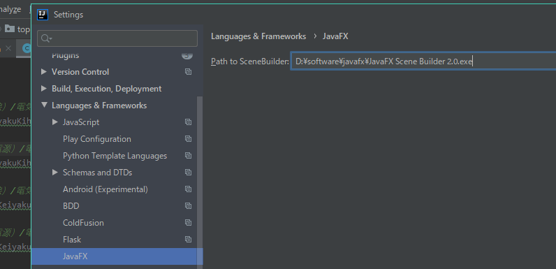

### windows设置开机自启动

设置启动项

1.找到启动文件夹，我的是C:\Users\ThinkPad\AppData\Roaming\Microsoft\Windows\Start Menu\Programs\Startup，或者打开运行，输入shell:startup，回车，也可以快速打开启动文件夹。

### IDEA中使用scene builder

- javafx_scenebuilder-2_0-windows.msi下载之后进行安装，安装好之后，桌面会有个这样的图标

-   在IDEA中启用 JavaFX 插件：Ctrl+Alt+S，点击plugin(插件)，然后搜索fx，勾上JavaFx的复选框，OK 
- 设置如下IEAD的配置

