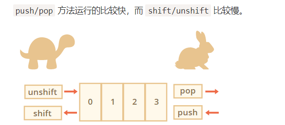
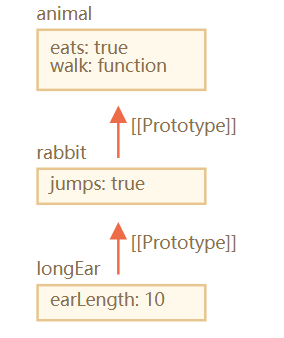

** `如果设置了** `src` **属性，**`script` **标签内容将会被忽略。**

### 与用户交互的 3 个浏览器指定的函数：

我们使用浏览器作为工作环境，所以基本的 UI 功能将是：

- [`prompt(question[, default])`](https://developer.mozilla.org/zh/docs/Web/API/Window/prompt)

  询问一个问题，并返回访问者输入的内容，如果他按下「取消」则返回 `null`。

- [`confirm(question)`](https://developer.mozilla.org/zh/docs/Web/API/Window/confirm)

  提出一个问题，并建议在确定和取消之间进行选择。该选项以 `true/false` 形式返回。

- [`alert(message)`](https://developer.mozilla.org/zh/docs/Web/API/Window/alert)

  输出一个 `消息`。

所有这些函数都会产生**模态框**，它们会暂停代码执行并阻止访问者与页面交互，直到用户输入内容。

### 使用幂运算符

```javascript
alert( 2 ** 2 ); // 4  (2 * 2)
alert( 2 ** 3 ); // 8  (2 * 2 * 2) 
alert( 2 ** 4 ); // 16 (2 * 2 * 2 * 2)
```

### 函数表达式 vs 函数声明

例如下面的代码会正常工作：

```js
sayHi("John"); // Hello, John
function sayHi(name) {
  alert( `Hello, ${name}` );
}
```

如果它是一个函数表达式，它就不会工作：

```js
sayHi("John"); // error!
let sayHi = function(name) {  // (*) no magic any more
  alert( `Hello, ${name}` );
};
```

**严格模式下，当一个函数声明在一个代码块内运行时，它在该块内的任何地方都是可见的。但块外则相反。**

### 用箭头函数重写 [ ](https://zh.javascript.info/function-expressions-arrows#yong-jian-tou-han-shu-zhong-xie)

用箭头函数重写下面的函数表达式：

```javascript
function ask(question, yes, no) {
  if (confirm(question)) yes()
  else no();
}

ask(
  "Do you agree?",
  function() { alert("You agreed."); },
  function() { alert("You canceled the execution."); }
);
```

---

```js
function ask(question, yes, no) {
  if (confirm(question)) yes()
  else no();
}

ask(
  "Do you agree?",
  () => alert("You agreed."),
  () => alert("You canceled the execution.")
);
```

### `typeof` 运算符返回值的类型，但有两个例外：

```javascript
typeof null == "object" // 语言的设计错误
typeof function(){} == "function" // 函数被特殊对待
```

引用：[变量](https://zh.javascript.info/variables) 和 [数据类型](https://zh.javascript.info/types)。

### “switch” 结构

“switch” 结构可以替代多个 `if` 检查，它内部使用 `===`（严格相等）进行比较。

例如：

```javascript
let age = prompt('Your age?', 18);

switch (age) {
  case 18:
    alert("Won't work"); // 提示的结果是一个字符串，而不是数字

  case "18":
    alert("This works!");
    break;

  default:
    alert("Any value not equal to one above");
}
```

### Debugger 命令 [>](https://zh.javascript.info/debugging-chrome#debugger-ming-ling)

我们也可以使用 `debugger` 命令来暂停代码，像这样：

```javascript
function hello(name) {
  let phrase = `Hello, ${name}!`;

  debugger;  // <-- 调试器会在这停止

  say(phrase);
}
```

当我们在一个代码编辑器中并且不想切换到浏览器在开发者工具中查找脚本来设置断点时，这真的是非常方便啦。

## Objects（对象）：基础知识 [》](https://zh.javascript.info/object-basics)

### 可以用下面两种语法的任一种来创建一个空的对象（“空柜子”）：

```javascript
let user = new Object(); // “构造函数” 的语法
let user = {};  // “字面量” 的语法
```

### 可以用多字词语来作为属性名，但是他们必须加上引号：

```javascript
let user = {
  name: "John",
  age: 30,
  "likes birds": true  // 多词属性名必须加引号
};
```

```javascript
// 语法错误
user.likes birds = true
```

```javascript
// set
user["likes birds"] = true;

// get
alert(user["likes birds"]); // true
```

### 计算属性

```javascript
let fruit = prompt("Which fruit to buy?", "apple");

let bag = {
  [fruit]: 5, // 属性名从 fruit 变量中计算
};

alert( bag.apple ); // 5 如果 fruit="apple"
```

### 用存在的变量当做属性名时的简写

我们可以把简写方式和正常方式混用：

___

```javascript
let user = {
  name,  // 与 name:name 相同
  age: 30
};
```

### 对象的存在值检查

```javascript
let user = {};
alert( user.noSuchProperty === undefined ); // true 意思是没有这个属性

//同样也有一个特别的操作符 "in" 来检查是否属性存在。
"key" in object
//注意 in 的左边必须是属性名。通常是一个字符串，如果不用字符串，那就是一个字符串变量。
```

### 对象属性的顺序？

”有特别的顺序“：整数属性有顺序，其他的是按照创建的顺序排序。

### 整数属性是什么？

```javascript
//“49” 是一个整数属性名，因为我们把它转换成整数，再转换回来，它还是一样。但是 “+49” 和 “1.2” 就不行了：
// Math.trunc 是内置的去除小数部分的方法。
alert( String(Math.trunc(Number("49"))) ); // "49"，同样，整数属性
alert( String(Math.trunc(Number("+49"))) ); // "49"，不同于 "+49" ⇒ 不是整数属性
alert( String(Math.trunc(Number("1.2"))) ); // "1"，不同于 "1.2" ⇒ 不是整数属性
```

### `Object.assign()`的使用

```javascript
let user = { name: "John" };

let permissions1 = { canView: true };
let permissions2 = { canEdit: true };

// 把 permissions1 和 permissions2 的所有属性都拷贝给 user
Object.assign(user, permissions1, permissions2);

// 现在 user = { name: "John", canView: true, canEdit: true }
// 如果接收的对象（user）已经有了同样属性名的属性，前面的会被覆盖：
```


### 按下面的要求写代码：

1. 创建一个空的 `user` 对象.

2. 为这个对象增加一个属性，键是 `name` 值是 `John`。

3. 再增加一个属性键`surname`值 `Smith`。

4. 把 `name` 属性的值改成 `Pete`。

5. 从对象中删除 `name` 属性

---

```js
let user={};
user.name="John";
user.surname="Smith";
user.name="pete";
delete user.name;
```

### Symbol类型

Symbol 总是不同的值，即使它们有相同的名称。如果我们希望同名 Symbol 相等，那么我们应该使用全局注册表：`Symbol.for(key)` 返回（如果需要的话创建）一个以 `key` 作为名称的全局 Symbol。`Symbol.for` 的多次调用完全返回相同的 Symbol。

Symbol 不是 100% 隐藏的。有一个内置方法 [Object.getOwnPropertySymbols(obj)](https://developer.mozilla.org/zh/docs/Web/JavaScript/Reference/Global_Objects/Object/getOwnPropertySymbols) 允许我们获取所有的 Symbol。还有一个名为 [Reflect.ownKeys(obj)](https://developer.mozilla.org/zh/docs/Web/JavaScript/Reference/Global_Objects/Reflect/ownKeys) 返回**所有**键，包括 Symbol。

### 对象方法与 "this"

this总是指向该方法所属的对象。

从不同的对象中调用同一个函数可能会有不同的 “this” 值：

非严格模式下，函数中的`this` 将会是**全局对象**（浏览器中的 `window`）。

### 箭头函数没有自己的 “this”

箭头函数的this指向当前函数内的this。

```javascript
let user = {
  firstName: "Ilya",
  sayHi() {
    let arrow = () => alert(this.firstName);
    arrow();
  }
};
//this 值取决于外部『正常的』函数
user.sayHi(); // Ilya
```

### 这段代码的结果是什么？

```javascript
let user = {
  name: "John",
  go: function() { alert(this.name) }
}

(user.go)()
```

---

**出现此错误是因为在 user = {...} 之后遗漏了一个分号。**

### 在对象字面量中使用 "this

这里 `makeUser` 函数返回了一个对象。

访问 `ref` 的结果是什么？为什么？

```javascript
function makeUser() {
  return {
    name: "John",
    ref: this
  };
};

let user = makeUser();

alert( user.ref.name ); // What's the result?
```

---

1. 这里的this实际上取得的是window对象，也就是说user.ref.name被看作成window的属性。
2. 严格模式下的这里的 `this` 值为 `undefined`
3. 在方法中的this返回的是该方法所属的对象。

### 创建一个计算器（对象）

创建一个有三个方法的 `calculator` 对象：

- `read()` 提示输入两个值，将其保存为对象属性。
- `sum()` 返回保存的值的和。
- `mul()` 将保存的值相乘并返回其结果。

---

```js
let calculator = {
    first:null,
    second:null,
    read:function () {
        this.first=+prompt("第一个值：");
        this.second=+prompt("第二个值：");
    },
    sum:function(){
        return this.first + this.second;
    },
    mul:function(){
        return this.first*this.second;
    }
};
calculator.read();
alert( calculator.sum() );
alert( calculator.mul() );
})
```

### 链式（调用)

有一个可以上下移动的 `ladder` 对象：

```javascript
let ladder = {
  step: 0,
  up() {
    this.step++;
  },
  down() {
    this.step--;
  },
  showStep: function() { // shows the current step
    alert( this.step );
  }
};
```

修改 `up` 和 `down` 的代码让调用可以链接，就像这样：

```javascript
ladder.up().up().down().showStep(); // 1
```

此种方法在 JavaScript 库中被广泛使用。

---

```js

let ladder = {
    step: 0,
    up() {
        this.step++
        return this;
    },
    down() {
        this.step--;
        return this;
    },
    showStep: function () { // shows the current step
        alert(this.step);
    }
};
ladder.up().up().down().showStep(); // 1
```

### `Symbol.toPrimitive` 对象原始值转换的使用？

```javascript
//第一种方式
let obj={};
obj[Symbol.toPrimitive] = function(hint) {
  // 返回一个原始值
  // hint = "string"，"number" 和 "default" 中的一个
}

//第二种方式
let user = {
  name: "John",
  money: 1000,

  [Symbol.toPrimitive](hint) {
    alert(`hint: ${hint}`);
    return hint == "string" ? `{name: "${this.name}"}` : this.money;
  }
};

// 转换演示：
alert(user); // hint: string -> {name: "John"}
alert(+user); // hint: number -> 1000
alert(user + 500); // hint: default -> 1500
```

### 为了进行转换，JavaScript 尝试查找并调用三个对象方法：

1. 调用 `obj[Symbol.toPrimitive](hint)` 如果这个方法存在的话，

2. 否则如果暗示是"string"
   - 尝试 `obj.toString()` 和 `obj.valueOf()`，无论哪个存在。
3. 否则，如果暗示"number"或者"default"
   - 尝试 `obj.valueOf()` 和 `obj.toString()`，无论哪个存在。

### 对象中方法定义的简写

```javascript
// 方法简写看起来更好，对吧？
let user = {
  sayHi() { // 与 "sayHi: function()" 一样
    alert("Hello");
  }
};
```

### 使用this的好处

```javascript
let user = {
  name: "John",
  age: 30,

  sayHi() {
    alert( user.name ); // 导致错误
  }

};


let admin = user;
user = null; // 覆盖让其更易懂

admin.sayHi(); // 噢哟！在 sayHi() 使用了旧的变量名。错误！
```

### JS中的引用类型

```javascript
let user = {
  name: "John",
  hi() { alert(this.name); },
  bye() { alert("Bye"); }
};

user.hi(); // John (the simple call works)

// 现在我们要判断 name 属性，来决定调用 user.hi 或是 user.bye。
(user.name == "John" ? user.hi : user.bye)(); // Error!
```

1. 为了让 `user.hi() `有效，JavaScript 用一个技巧 —— 这个 '.' 点返回的不是一个函数，而是一种特殊的引用类型的值。
2. `hi = user.hi` 赋值等其他的操作，将引用类型作为一个整体丢弃，只获取 `user.hi`（一个函数）的值进行传递。

```javascript
//引用类型的值是三点的结合 (base, name, strict)，如下
// 引用类型值
(user, "hi", true)
```

### 解释 "this" 的值

在下面的代码中，我们试图连续调用 4 次 `user.go()` 方法。

但是 `(1)` 和 `(2)` 次 `(3)` 和 `(4)` 调用结果不同，为什么呢？

```javascript
let obj, method;

obj = {
  go: function() { alert(this); }
};

obj.go();               // (1) [object Object]

(obj.go)();             // (2) [object Object]

(method = obj.go)();    // (3) undefined

(obj.go || obj.stop)(); // (4) undefined
```

---

这里是解释。

1. 它是一个常规的方法调用。

2. 同样，括号没有改变执行的顺序，点总是首先执行。

3. 这里我们有一个更复杂的 `(expression).method()` 调用。这个调用就像被分成了两行（代码）一样：

   ```javascript
   f = obj.go; // calculate the expression
   f();        // call what we have
   ```

这里的 `f()` 是作为一个没有（设定）`this` 的函数执行的。

1. 与 `(3)` 相类似，在点 `.` 的左边也有一个表达式。

要解释 `(3)` 和 `(4)` 的原因，我们需要回顾一下属性访问器（点或方括号）返回的值是引用类型的。

除了方法调用之外的任何操作（如赋值 `=` 或 `||` 等）把它变为了一个没有设定 `this` 信息的普通值。

## 构造函数

### 构造函数概念

构造函数在技术上是常规函数。不过有两个约定：

---

1. 他们首先用大写字母命名。
2. 它们只能用 `new` 操作符来执行。

### 当一个函数作为 `new User(...)`执行时，它执行以下步骤

1. 一个新的空对象被创建并分配给 `this`。
2. 函数体执行。通常它会修改 `this`，为其添加新的属性。
3. 返回 `this` 的值。

从技术上讲，任何函数都可以用作构造函数。即：任何函数都可以运行 `new`，它会执行上面的算法。

如果没有参数我们 `new` 可以省略括号：

```javascript
let user = new User; // <-- no parentheses
// same as
let user = new User();
//这里省略括号不被认为是一种“好风格”，但是规范允许使用该语法。
```

### 双语法构造函数：`new.target`

```javascript
function User() {
  alert(new.target);
}

// 不带 new：
User(); // undefined

// 带 new：
new User(); // function User { ... }
```

这可以使 `new` 和常规语法的工作原理相同：

```javascript
function User(name) {
  if (!new.target) { // 如果你没有运行 new
    return new User(name); // ...会为你添加 new
  }

  this.name = name;
}

let john = User("John"); // 重新调用 new User
alert(john.name); // John
```

### 构造函数 Return

带有对象的 `return` 返回该对象，在所有其他情况下返回 `this`。

### 问题：

#### Two functions – one object

是否可以创建函数 `A` 和 `B`，如 `new A()==new B()`？

```javascript
function A() { ... }
function B() { ... }

let a = new A;
let b = new B;

alert( a == b ); // true
```

如果可以，请提供他们的代码示例。

---

```javascript
let obj = {};

function A() { return obj; }
function B() { return obj; }

alert( new A() == new B() ); // true
```

#### 创建 new Calculator

创建一个构造函数使用3种方法创建对象的 `Calculator`：

- `read()` 使用 `prompt` 请求两个值并在对象属性中记住它们。
- `sum()` 返回这些属性的总和。
- `mul()` 返回这些属性的乘积。

例如：

```javascript
let calculator = new Calculator();
calculator.read();

alert( "Sum=" + calculator.sum() );
alert( "Mul=" + calculator.mul() );
```

---

```javascript
function Calculator() {

  this.read = function() {
    this.a = +prompt('a?', 0);
    this.b = +prompt('b?', 0);
  };

  this.sum = function() {
    return this.a + this.b;
  };

  this.mul = function() {
    return this.a * this.b;
  };
}

let calculator = new Calculator();
calculator.read();

alert( "Sum=" + calculator.sum() );
alert( "Mul=" + calculator.mul() );
```

## 数据类型

### 在 JavaScript 中有 6 种基本类型：

- `string`、`number`、`boolean`、`symbol`、`null` 和 `undefined`。

### 基本类型的包装对象

极其不推荐使用构造函数 `String/Number/Boolean`，为什么？

特殊的基本类型 `null` 和 `undefined` 是个例外。他们没有相应的“包装对象”，

基本类型不是对象。

基本类型不能存储数据。

所有的属性/方法操作都是在临时对象的帮助下执行的。

---

```javascript
alert( typeof 1 ); // "number"
alert( typeof new Number(1) ); // "object"!
//导致下面问题
let zero = new Number(0);
if (zero) { // zero is true, because it's an object
  alert( "zero is truthy?!?" );
}
```

## 数字类型

### `js`中编写数字的更多方法

```js
//数字简写
1e-3 = 1 / 1000 (=0.001)
1.23e-6 = 1.23 / 1000000 (=0.00000123)
//16进制
alert( 0xff ); // 255
alert( 0xFF ); // 255 (the same, case doesn't matter)
//2进制
let a = 0b11111111; // binary form of 255
//8进制
let b = 0o377; // octal form of 255
alert( a == b ); // true, the same number 255 at both sides
```

### `num.toString(base)`

```javascript
let num = 255;

alert( num.toString(16) );  // ff
alert( num.toString(2) );   // 11111111
```

常见的用例如下：

- **base=16** 用于十六进制颜色，字符编码等，数字可以是 `0..9` 或 `A..F`。
- **base=2** 主要用于调试按位操作，数字可以是 `0` 或 `1`。
- **base=36** 是最大值，数字可以是 `0..9` 或 `A..Z`。整个拉丁字母用来表示一个数字。对于 `36` 来说，一个有趣而有用的例子是，当我们需要将一个较长的数字标识符变成较短的时候，例如做一个简短的URL。可以简单地用基数为 `36` 的数字系统表示：

### 数字调用方法的两个点

```javascript
alert( 123456..toString(36) ); // 2n9c
```

---

请注意 `123456..toString(36)` 中的两个点不是拼写错误。如果我们想直接在一个数字上调用一个方法，比如上面例子中的 `toString`，那么我们需要在它后面放置两个点 `..`。

如果我们放置一个点：`123456.toString(36)`，那么会出现错误，因为 JavaScript 语法暗示了第一个点之后的小数部分。如果我们再放一个点，那么 JavaScript 知道小数部分是空的，现在进入方法。

也可以写 `(123456).toString(36)`。

### `Math.trunc`方法

删除小数点后的所有内容而不舍入：`3.1` 变成 `3`，`-1.1` 变成 `-1`。

### ` toFixed(n)`方法

函数 [toFixed(n)](https://developer.mozilla.org/en-US/docs/Web/JavaScript/Reference/Global_Objects/Number/toFixed) 将点数后的数字四舍五入到 `n` 个数字并返回结果的**字符串**表示。

```javascript
let num = 12.34;
alert( num.toFixed(1) ); // "12.3"

let num = 12.36;
alert( num.toFixed(1) ); // "12.4"
```

### 如何解决js数字精度丢失问题

我们能解决这个问题吗？当然，有很多方法：

1. 我们可以在特定函数的帮助下对结果进行四舍五入 [toFixed(n)](https://developer.mozilla.org/en-US/docs/Web/JavaScript/Reference/Global_Objects/Number/toFixed)：

   ```javascript
   let sum = 0.1 + 0.2;
   alert( sum.toFixed(2) ); // 0.30
   ```

   请注意 `toFixed` 总是返回一个字符串。它确保它在小数点后有 2 位数字。如果我们有电子购物并需要显示 `0.30 美元`，这实际上很方便。对于其他情况，我们可以使用一元加号将它强制为一个数字：

   ```javascript
   let sum = 0.1 + 0.2;
   alert( +sum.toFixed(2) ); // 0.3
   ```

2. 我们可以暂时将数字转换为数学整数，然后将其恢复。它是这样工作的：

   ```javascript
   alert( (0.1 * 10 + 0.2 * 10) / 10 ); // 0.3
   ```

   这是有效的，因为当我们做 `0.1 * 10 = 1` 和 `0.2 * 10 = 2` 时，那么这两个数字就变成了整数，并且没有精度损失。

3. 如果我们在与一家商店打交道，那么最激进的解决方案就是将所有价格存储在美分中，并且根本不使用分数。但是，如果我们应用 30％ 的折扣呢？在实践中，完全回避分数是很难实现的，所以上述解决方案有助于避免这种缺陷。

### 测试：`isFinite` 和` isNaN`

- `isNaN(value)` 将其参数转换为数字，然后测试它是否为 `NaN`：

  ```javascript
  alert( isNaN(NaN) ); // true
  alert( isNaN("str") ); // true
  ```

  但是我们需要这个功能吗？我们不能只使用比较 `=== NaN` 吗？对不起，但答案是否定的。值 “NaN” 是独一无二的，它不等于任何东西，包括它本身：

  ```javascript
  alert( NaN === NaN ); // false
  ```

- `isFinite(value)` 将其参数转换为数字，如果是常规数字，则返回 `true`，而不是 `NaN / Infinity / -Infinity`：

  ```javascript
  alert( isFinite("15") ); // true
  alert( isFinite("str") ); // false, because a special value: NaN
  alert( isFinite(Infinity) ); // false, because a special value: Infinity
  ```

- `Object.is`可以比较 `===` 等值，但对于两种边缘情况更可靠：
  1. 它适用于 `NaN`： `Object.is（NaN，NaN）=== true`，这是件好事。
  2. 值 `0` 和 `-0` 是不同的：`Object.is（0，-0）=== false`，它不是很重要，但这些值在技术上是不同的。

### `parseInt` 和` parseFloat`

使用加号 `+` 或 `Number()` 的数字转换是严格的。如果一个值不完全是一个数字，就会失败：

```javascript
alert( +"100px" ); // NaN
```

 `parseInt` 和 `parseFloat` 从字符串中“读出”一个数字，直到他们可以。如果发生错误，则返回收集的数字:

- `parseInt(str，base)` 解析来自任何数字系统的整数，其基数为：`2≤base≤36`。

```javascript
alert( parseInt('100px') ); // 100
alert( parseFloat('12.5em') ); // 12.5
alert( parseInt('12.3') ); // 12, only the integer part is returned
alert( parseFloat('12.3.4') ); // 12.3, the second point stops the reading

alert( parseInt('a123') ); // NaN, the first symbol stops the process
```

## 字符串

### 3种字符串类型：

在 JavaScript 中，字符串不可更改。改变字符是不可能的。

字符串可以包含在单引号、双引号或反引号中：

```javascript
let single = 'single-quoted';
let double = "double-quoted";

let backticks = `backticks`;
```

### 可以使用 `for..of` 遍历字符：

```javascript
for (let char of "Hello") {
  alert(char); // H,e,l,l,o （char 变为“H”，然后是“e”，然后是“l”等）
}
```

### 按位（bitwise）NOT 技巧

```javascript
let str = "Widget";

if (~str.indexOf("Widget")) {
  alert( 'Found it!' ); // 正常运行
}
```

### `str.includes(substr, pos)`

更现代的方法 [str.includes(substr, pos)](https://developer.mozilla.org/zh/docs/Web/JavaScript/Reference/Global_Objects/String/includes) 取决于 `str` 是否包含 `substr` 来返回 `true/false`。

```javascript
alert( "Widget with id".includes("Widget") ); // true
alert( "Hello".includes("Bye") ); // false
alert( "Midget".includes("id") ); // true
alert( "Midget".includes("id", 3) ); // false, 位置 3 没有“id”
```

### JavaScript 中有三种获取字符串的方法：`substring`、`substr` 和 `slice`。

| 方法                    | 选择方式……                                | 负号参数            |
| :---------------------- | :---------------------------------------- | :------------------ |
| `slice(start, end)`     | 从 `start` 到 `end` (不含 `end`)          | 允许                |
| `substring(start, end)` | `start` 与 `end` 之间                     | 负值代表 `0`        |
| `substr(start, length)` | 从 `start` 开始获取长为 `length` 的字符串 | 允许 `start` 为负数 |

## 数组

### 创建一个空数组有两种语法：

```javascript
let arr = new Array();
let arr = [];
```

### 数组可以存储任何类型的元素。

- 数组和对象一样，都可以在末尾冗余一个逗号。
- 数组是一种特殊的对象。使用方括号来访问属性 `arr[0]` 实际上是来自于对象的语法。这个数字被用作键值。他们扩展了对象，提供了特殊的方法来处理有序的数据集合，还添加了 `length` 属性。但是核心还是一个对象。
- 数组有自己的 `toString` 方法的实现，会返回以逗号隔开的元素列表。

```javascript
// 混合值
let arr = [ 'Apple', { name: 'John' }, true, function() { alert('hello'); } ];

// 获取索引为 1 的对象然后显示它的 name
alert( arr[1].name ); // John

// 获取索引为 3 的函数并执行
arr[3](); // hello
```

### pop/push, shift/unshift 方法

- `push` 在末端添加一个元素.
- `shift` 取出队列最前端的一个元素，整个队列往前移，这样原先排第二的元素现在排在了第一。
- `pop` 从末端取出一个元素.
- `unshift` 在数组的前端添加元素：

### 数组误用的几种方式:

- 添加一个非数字的属性比如 `arr.test = 5`。
- 制造空洞，比如：添加 `arr[0]` 后添加 `arr[1000]` (它们中间什么都没有)。
- 以倒序填充数组, 比如 `arr[1000]`，`arr[999]` 等等。

### 2种简化for循环的格式

`for..in`:遍历对象的属性名

`for..of `：遍历数据元素。

### 关于 “length” [》](https://zh.javascript.info/array#guan-yu-length)

当我们修改数组的时候，`length` 属性会自动更新。准确来说，它实际上不是数组里元素的个数，而是最大的数字索引值加一。

`length` 属性的另一个有意思的点是它是可写的。

```javascript
let arr = [1, 2, 3, 4, 5];

arr.length = 2; // 只剩 2 个元素
alert( arr ); // [1, 2]

arr.length = 5; // 又把 length 加回来
alert( arr[3] ); // undefined: 被截断的那些数值并没有回来
```

所以，清空数组最好的方法就是：`arr.length = 0;`。

## 数组方法

### `arr.splice(index[, deleteCount, elem1, ..., elemN])`

从 `index` 开始：删除 `deleteCount` 元素并在当前位置插入 `elem1, ..., elemN`。最后返回已删除元素的数组。

**允许负向索引**

```javascript
// from index -1 (one step from the end)
// delete 0 elements,
// then insert 3 and 4
//它们从数组末尾计算位置
arr.splice(-1, 0, 3, 4);
```

### `arr.slice(start, end)`

它从所有元素的开始索引 `"start"` 复制到 `"end"` (不包括 `"end"`) 返回一个新的数组。

### `arr.concat(arg1, arg2...)`

它接受任意数量的参数 — 数组或值。

结果是一个包含`arr`，`arg1`，`arg2`等元素的新数组。

如果参数是一个数组或具有 `Symbol.isConcatSpreadable` 属性，则其所有元素都将被复制。否则，复制参数本身。

```javascript
let arr = [1, 2];
let arrayLike = {
  0: "something",
  length: 1
};
alert( arr.concat(arrayLike) ); // 1,2,[object Object]
//[1, 2, arrayLike]

let arr = [1, 2];

let arrayLike = {
  0: "something",
  1: "else",
  [Symbol.isConcatSpreadable]: true,
  length: 2
};

alert( arr.concat(arrayLike) ); // 1,2,something,else
```

### `indexOf` `lastIndexOf ` `includes`

- `arr.indexOf(item, from)` 从索引 `from` 查询 `item`，如果找到返回索引，否则返回 `-1`。
- `arr.lastIndexOf(item, from)` — 和上面相同，只是从尾部开始查询。
- `arr.includes(item, from)` — 从索引 `from` 查询 `item`，如果找到则返回 `true`。

### `find` 和`findIndex`

```javascript
let result = arr.find(function(item, index, array) {
  // 如果查询到返回 true
});
```

- `item` 是元素。
- `index` 是它的索引。
- `array` 是数组本身。

与 [arr.findIndex](https://developer.mozilla.org/zh/docs/Web/JavaScript/Reference/Global_Objects/Array/findIndex) 方法本质上是相同的，但它返回找到元素的索引而不是元素本身。

### `arr.filter`

```javascript
let users = [
  {id: 1, name: "John"},
  {id: 2, name: "Pete"},
  {id: 3, name: "Mary"}
];
// 返回前两个用户的数组
let someUsers = users.filter(item => item.id < 3);
alert(someUsers.length); // 2
```

### `arr.map`

```javascript
let result = arr.map(function(item, index, array) {
  // 返回新值而不是当前元素
})
```

### `arr.sort(fn)`

**默认情况下按字符串排序。**

```javascript
function compareNumeric(a, b) {
  if (a > b) return 1;
  if (a == b) return 0;
  if (a < b) return -1;
}

let arr = [ 1, 2, 15 ];

arr.sort(compareNumeric);

alert(arr);  // 1, 2, 15
```

### `arr.reverse`

[arr.reverse](https://developer.mozilla.org/zh/docs/Web/JavaScript/Reference/Global_Objects/Array/reverse) 方法颠倒 `arr` 中元素的顺序。

### `str.split `和`arr.join`

```javascript
let names = 'Bilbo, Gandalf, Nazgul';
let arr = names.split(', ');
for (let name of arr) {
  alert( `A message to ${name}.` ); // A message to Bilbo  (and other names)
}

//arr.join(str) 与 split 相反。它会在它们之间创建一串由 str 粘合的 arr 项。
let arr = ['Bilbo', 'Gandalf', 'Nazgul'];
let str = arr.join(';');
alert( str ); // Bilbo;Gandalf;Nazgul
```

### `arr.reduce/arr.reduceRight`

```javascript
let value = arr.reduce(function(previousValue, item, index, arr) {
  // ...
}, initial);
```

### `arr.forEach`

```javascript
arr.forEach(function(item, index, array) {
  // ... do something with item
});
```

### `Array.isArray`

数组基于对象。不构成单独的语言类型。

所以 `typeof` 无法从对象中区分出数组来：

```javascript
alert(Array.isArray({})); // false

alert(Array.isArray([])); // true
```

### `thisArg`的含义

几乎所有调用函数的数组方法 – 比如 `find`，`filter`，`map`，与带有 `sort` 的不同，他们接受一个可选的附加参数 `thisArg`。

```javascript
let user = {
  age: 18,
  younger(otherUser) {
    return otherUser.age < this.age;
  }
};

let users = [
  {age: 12},
  {age: 16},
  {age: 32}
];

// 找到比 user 小的所有 users
let youngerUsers = users.filter(user.younger, user);

alert(youngerUsers.length); // 2
```

在上面我们使用 `user.younger` 作为过滤器，并提供 `user` 作为它的上下文。如果我们没有提供上下文，`users.filter(user.younger)` 会调用`user.younger` 作为一个独立的函数，这时 `this=undefined`。

### 数组方法备忘录：

- 添加/删除元素：
  - `push(...items)` — 从结尾添加元素，
  - `pop()` — 从结尾提取元素，
  - `shift()` — 从开头提取元素，
  - `unshift(...items)` — 从开头添加元素，
  - `splice(pos, deleteCount, ...items)` — 从 `index` 开始：删除 `deleteCount` 元素并在当前位置插入元素。
  - `slice(start, end)` — 它从所有元素的开始索引 `"start"` 复制到 `"end"` (不包括 `"end"`) 返回一个新的数组。
  - `concat(...items)` — 返回一个新数组：复制当前数组的所有成员并向其中添加 `items`。如果有任何`items` 是一个数组，那么就取其元素。
- 查询元素：
  - `indexOf/lastIndexOf(item, pos)` — 从 `pos` 找到 `item`，则返回索引否则返回 `-1`。
  - `includes(value)` — 如果数组有 `value`，则返回 `true`，否则返回 `false`。
  - `find/filter(func)` — 通过函数过滤元素，返回 `true` 条件的符合 find 函数的第一个值或符合 filter 函数的全部值。
  - `findIndex` 和 `find` 类似，但返回索引而不是值。
- 转换数组：
  - `map(func)` — 从每个元素调用 `func` 的结果创建一个新数组。
  - `sort(func)` — 将数组倒序排列，然后返回。
  - `reverse()` — 在原地颠倒数组，然后返回它。
  - `split/join` — 将字符串转换为数组并返回。
  - `reduce(func, initial)` — 通过为每个元素调用 `func` 计算数组上的单个值并在调用之间传递中间结果。
- 迭代元素：
  - `forEach(func)` — 为每个元素调用 `func`，不返回任何东西。
- 其他：  – `Array.isArray(arr)` 检查 `arr` 是否是一个数组。

请注意，`sort`，`reverse` 和 `splice` 方法修改数组本身。

这些方法是最常用的方法，它们覆盖 99％ 的用例。但是还有其他几个：

- [arr.some(fn)](https://developer.mozilla.org/zh/docs/Web/JavaScript/Reference/Global_Objects/Array/some)/[arr.every(fn)](https://developer.mozilla.org/zh/docs/Web/JavaScript/Reference/Global_Objects/Array/every) 检查数组。

  在类似于 `map` 的数组的每个元素上调用函数 `fn`。如果任何/所有结果为 `true`，则返回 `true`，否则返回 `false`。

- [arr.fill(value, start, end)](https://developer.mozilla.org/zh/docs/Web/JavaScript/Reference/Global_Objects/Array/fill) — 从 `start` 到 `end` 用 `value` 重复填充数组。

- [arr.copyWithin(target, start, end)](https://developer.mozilla.org/zh/docs/Web/JavaScript/Reference/Global_Objects/Array/copyWithin) —将其元素从 `start` 到 `end` 在 `target` 位置复制到 **本身**（覆盖现有）。

## `Symbol.iterator`（可迭代对象）

数组和字符串是应用最广泛的内建可迭代对象。

### 可迭代对象概念

- `obj[Symbol.iterator]` 的结果被称为**迭代器**。由它处理更深入的迭代过程。
- 一个迭代器必须有 `next()` 方法，它返回一个 `{done: Boolean, value: any}`，这里 `done:true` 表明迭代结束，否则 `value` 就是下一个值。

### `Symbol.iterator` 的实现例子

```javascript
let range = {
  from: 1,
  to: 5
};

// 1. 使用 for..of 将会首先调用它：
range[Symbol.iterator] = function() {

  // 2. ...它返回一个迭代器：
  return {
    current: this.from,
    last: this.to,

    // 3. next() 将在 for..of 的每一轮循环迭代中被调用
    next() {
      // 4. 它将会返回 {done:.., value :...} 格式的对象
      if (this.current <= this.last) {
        return { done: false, value: this.current++ };
      } else {
        return { done: true };
      }
    }
  };
};

// 现在它可以运行了！
for (let num of range) {
  alert(num); // 1, 然后 2, 3, 4, 5
}
```

第二种

```javascript
let range = {
  from: 1,
  to: 5,

  [Symbol.iterator]() {
    this.current = this.from;
    return this;
  },

  next() {
    if (this.current <= this.to) {
      return { done: false, value: this.current++ };
    } else {
      return { done: true };
    }
  }
};

for (let num of range) {
  alert(num); // 1, 然后 2, 3, 4, 5
}
```

### 显式调用迭代器

```javascript
let str = "Hello";

// 和下面代码完成的功能一致
// for (let char of str) alert(char);

let iterator = str[Symbol.iterator]();

while (true) {
  let result = iterator.next();
  if (result.done) break;
  alert(result.value); // 一个一个输出字符
}
```

### 可迭代对象和类数组对象

- **Iterables** 是应用于 `Symbol.iterator` 方法的对象，像上文所述。
- **Array-likes** 是有索引和 `length` 属性的对象，所以它们很像数组。

```javascript
let arrayLike = { // 有索引和长度 => 类数组对象
  0: "Hello",
  1: "World",
  length: 2
};

// 错误（没有 Symbol.iterator）
for (let item of arrayLike) {}
```

### `Array.from`

有一个全局方法 [Array.from](https://developer.mozilla.org/zh/docs/Web/JavaScript/Reference/Global_Objects/Array/from) 可以以一个**可迭代对象**或者**类数组对象**作为参数并返回一个真正的 `Array` 数组。

```javascript
Array.from(obj[, mapFn, thisArg])
```

-  `mapFn` 应是一个在元素被添加到数组前，施加于每个元素的方法
- `thisArg` 允许设置方法的 `this` 对象

```javascript
let arrayLike = {
  0: "Hello",
  1: "World",
  length: 2
};

let arr = Array.from(arrayLike); // (*)
alert(arr.pop()); // World（pop 方法生效）
```

## `Map、Set、WeakMap` 和 `WeakSet`

### Map

[Map](https://developer.mozilla.org/zh/docs/Web/JavaScript/Reference/Global_Objects/Map) 是一个键值对的集合，很像 `Object`。但主要的区别是，`Map` 允许所有数据类型作为键。。

`NaN` 也可以作为键

主要的方法包括：

- `new Map()` – 创建 map。
- `map.set(key, value)` – 根据键（key）存储值（value），**可以链式调用**。
- `map.get(key)` – 根据键返回值，如果 map 中该键不存在，返回 `undefined`。
- `map.has(key)` – 如果键存在，返回 `true`，否则返回 `false`。
- `map.delete(key)` – 移除该键的值。
- `map.clear()` – 清空 map
- `map.size` – 返回当前元素个数。
- `map.forEach` – 遍历map

###  `Object.entries(obj)`

它可以返回一个对象的键值对数组

```javascript
let map = new Map(Object.entries({
  name: "John",
  age: 30
}));
```

这里，`Object.entries` 返回了键值对数组：`[ ["name","John"], ["age", 30] ]`

### 有三种方法可以循环遍历 `map`：

- `map.keys()` – 返回键的迭代器，
- `map.values()` – 返回值的迭代器，
- `map.entries()` – 返回 `[key, value]` 迭代器入口，`for..of` 循环会默认使用它。

注意：map的迭代顺序是值的插入顺序。

### Set

`Set` 是一个值的集合，这个集合中所有的值仅出现一次。

主要方法包括：

- `new Set(iterable)` – 创建 set，利用数组来创建是可选的（任何可迭代对象都可以）。
- `set.add(value)` – 添加值，返回 set 自身。
- `set.delete(value)` – 删除值，如果该 `value` 在调用方法的时候存在则返回 `true` ，否则返回 `false`。
- `set.has(value)` – 如果 set 中存在该值则返回 `true` ，否则返回 `false`。
- `set.clear()` – 清空 set。
- `set.size` – 元素个数。

我们可以使用 `for..of` 或者 `forEach` 来循环查看 set

### `WeakMap`和 `WeakSet`

- `WeakMap` —— `Map` 的一个变体，仅允许对象作为键，并且当对象由于其他原因不可引用的时候将其删除。
- 它不支持整体的操作：没有 `size` 属性，没有 `clear()` 方法，没有迭代器。
  
- `WeakSet` —— 是 `Set` 的一个变体，仅存储对象，并且当对象由于其他原因不可引用的时候将其删除。

  - 同样不支持 `size/clear()` 和迭代器。

### task:过滤 anagrams

[Anagrams](https://en.wikipedia.org/wiki/Anagram) 是有相同数量相同字母但是顺序不同的单词。

例如：

```none
nap - pan
ear - are - era
cheaters - hectares - teachers
```

写一个函数 `aclean(arr)`，它返回的数组中 anagrams 被删除。

例如：

```javascript
let arr = ["nap", "teachers", "cheaters", "PAN", "ear", "era", "hectares"];

alert( aclean(arr) ); // "nap,teachers,ear" or "PAN,cheaters,era"
```

对于所有的 anagram 组，需要保留任意一个单词。

---

```javascript
function aclean(arr) {
  let map = new Map();

  for (let word of arr) {
    // 将单词打散为字母，排序然后拼接回来
    let sorted = word.toLowerCase().split('').sort().join(''); // (*)
    map.set(sorted, word);
  }

  return Array.from(map.values());
}

let arr = ["nap", "teachers", "cheaters", "PAN", "ear", "era", "hectares"];

alert( aclean(arr) );
```

这里我们也可以使用一般的对象而不用 `Map`，因为键就是字符串：

```javascript
function aclean(arr) {
  let obj = {};

  for (let i = 0; i < arr.length; i++) {
    let sorted = arr[i].toLowerCase().split("").sort().join("");
    obj[sorted] = arr[i];
  }

  return Array.from(Object.values(obj));
}

let arr = ["nap", "teachers", "cheaters", "PAN", "ear", "era", "hectares"];

alert( aclean(arr) );
```

### task:存储 "unread" 标识

这里有一个 messages 数组：

```javascript
let messages = [
    {text: "Hello", from: "John"},
    {text: "How goes?", from: "John"},
    {text: "See you soon", from: "Alice"}
];
```

你的代码可以访问它，但是消息被其他代码管理。这段代码有规律的添加新消息，删除旧消息，而且你不知道这些操作发生的时间。

现在，你应该是用什么数据结构来保存消息是否已读这个信息？这个结构必须很适合给出当前已知的消息对象是否已读的答案。

附：当消息被从 `messages` 中移除的时候，它应该也从你的数据结构中消失。

附：我们不能直接修改消息对象。如果它们被其他代码管理，那么给他们添加额外的属性可能导致不好的后果。

---

明智的选择是 `WeakSet`：

```javascript
let messages = [
    {text: "Hello", from: "John"},
    {text: "How goes?", from: "John"},
    {text: "See you soon", from: "Alice"}
];

let readMessages = new WeakSet();

// 两个消息已读
readMessages.add(messages[0]);
readMessages.add(messages[1]);
// readMessages 包含两个元素

// ...让我们再读一遍第一条消息！
readMessages.add(messages[0]);
// readMessages 仍然有两个不重复的元素

// 回答：message[0] 已读？
alert("Read message 0: " + readMessages.has(messages[0])); // true

messages.shift();
// 现在 readMessages 有一个元素（技术上来说内存可能稍后被清理）
```

`WeakSet` 允许存储一系列的消息并且很容易就能检查它包含的消息是否还存在。

它会自动清理自身。但是作为交换，我们不能对它进行迭代。我们不能直接获取所有已读消息。但是我们可以通过迭代所有消息然后找出存在于 set 的那些消息来完成这个功能。

附：如果消息被其他代码管理，那么仅为了自己的功能给每个消息添加一个属性也许会很危险，但是我们可以将它改为 symbol 来规避冲突。

像这样：

```javascript
// the symbolic property is only known to our code
let isRead = Symbol("isRead");
messages[0][isRead] = true;
```

现在即使其他人的代码使用 `for..in` 循环消息的属性，我们的秘密标识也不会出现。

## 对象的键、值、项

### `Object.keys、values、entries` 三个方法

举个例子：

```javascript
let user = {
  name: "John",
  age: 30
};
```

- `Object.keys(user) = [name, age]`

- `Object.values(user) = ["John", 30]`

- `Object.entries(user) = [ ["name","John"], ["age",30] ]`

  

- [Object.keys(obj)](https://developer.mozilla.org/zh/docs/Web/JavaScript/Reference/Global_Objects/Object/keys) —— 返回一个包含该对象全部的键的**数组**。
- [Object.values(obj)](https://developer.mozilla.org/zh/docs/Web/JavaScript/Reference/Global_Objects/Object/values) —— 返回一个包含该对象全部的值的**数组**。
- [Object.entries(obj)](https://developer.mozilla.org/zh/docs/Web/JavaScript/Reference/Global_Objects/Object/entries) —— 返回一个包含该对象全部 [key, value] 键值对的**数组**。

跟 map 的区别：

|          | Map          | Object                                  |
| :------- | :----------- | :-------------------------------------- |
| 调用语法 | `map.keys()` | `Object.keys(obj)`，而不是 `obj.keys()` |
| 返回值   | 可迭代项     | 「真正的」数组                          |

## `Object.keys/values/entries` 忽略 Symbol 类型的属性

就像 `for..in` 循环，这些方法会忽略使用 `Symbol(...)` 作为键的属性。

- 通常这很方便。但是如果我们也想要获得 Symbol 类型的键，那么有另外不同的方法 [Object.getOwnPropertySymbols](https://developer.mozilla.org/zh/docs/Web/JavaScript/Reference/Global_Objects/Object/getOwnPropertySymbols)， 它会返回一个只包含 Symbol 类型的键的数组。
- [Reflect.ownKeys(obj)](https://developer.mozilla.org/zh/docs/Web/JavaScript/Reference/Global_Objects/Reflect/ownKeys) 方法会返回「所有」键。

## 解构赋值

### 数组解构

```javascript
// 有一个存放了名字和姓氏的数组
let arr = ["Ilya", "Kantor"]
// 解构赋值
let [firstName, surname] = arr;
//与 split 函数（或其他返回值是数组的函数）结合使用时
let [firstName, surname] = "Ilya Kantor".split(' ');
// 不需要第一个和第二个元素
let [, , title] = ["Julius", "Caesar", "Consul", "of the Roman Republic"];
//用于等号右侧的任何可迭代对象
let [a, b, c] = "abc"; // ["a", "b", "c"]
let [one, two, three] = new Set([1, 2, 3]);
//赋值给等号左侧的任何类型
let user = {};
[user.name, user.surname] = "Ilya Kantor".split(' ');
//剩余的 ‘…’
//rest 变量的值就是数组中剩下的元素组成的数组。
let [name1, name2, ...rest] = ["Julius", "Caesar", "Consul", "of the Roman Republic"];
```

### 解构赋值的默认值

```javascript
let [firstName, surname] = [];
alert(firstName); // undefined

// 默认值
let [name = "Guest", surname = "Anonymous"] = ["Julius"];
alert(name);    // Julius (来自数组的值)
alert(surname); // Anonymous (默认值被使用了)
```

### 对象解构

```javascript
let options = {
  title: "Menu"
};

//等号左侧的模式可以更加复杂，并给属性和变量之间指定一个映射关系。
//对于可能缺失的属性，我们可以使用 "=" 来指定默认值
let {width: w = 100, height: h = 200, title} = options;
alert(title);  // Menu
alert(w);      // 100
alert(h);      // 200
```

### 剩余操作符

```javascript
let options = {
  title: "Menu",
  height: 200,
  width: 100
};

let {title, ...rest} = options;

// now title="Menu", rest={height: 200, width: 100}
alert(rest.height);  // 200
alert(rest.width);   // 100
```

### 嵌套解构

```javascript
let options = {
  size: {
    width: 100,
    height: 200
  },
  items: ["Cake", "Donut"],
  extra: true    // 一些不会被解构的额外属性
};

// 为了清晰起见，解构赋值语句被写成多行
let {
  size: { // 把 size 赋值到这里
    width,
    height
  },
  items: [item1, item2], // 把 items 赋值到这里
  title = "Menu" // 在对象中不存在的属性（会使用默认值）
} = options;

alert(title);  // Menu
alert(width);  // 100
alert(height); // 200
alert(item1);  // Cake
alert(item2);  // Donut
```

### 智能函数参数

```javascript
let options = {
  title: "My menu",
  items: ["Item1", "Item2"]
};

function showMenu({
  title = "Untitled",
  width: w = 100,  // width 赋值给 w
  height: h = 200, // height 赋值给 h
  items: [item1, item2] // items 第一个元素赋值给 item1, 第二个元素赋值给 item2
}) {
  alert( `${title} ${w} ${h}` ); // My Menu 100 200
  alert( item1 ); // Item1
  alert( item2 ); // Item2
}

showMenu(options);
```

我们可以通过指定空对象 `{}` 为整个函数参数的默认值：

```javascript
// 清晰起见，精简了部分参数
function showMenu({ title = "Menu", width = 100, height = 200 } = {}) {
  alert( `${title} ${width} ${height}` );
}

showMenu(); // Menu 100 200
```

### 总结

- 解构赋值允许将对象或数组立即映射到多个变量上。

- 解构对象的语法：

  ```javascript
  let {prop : varName = default, ...} = object
  ```

  这表示属性 `prop` 会被赋值给变量 `varName`，如果没有这个属性的话，就会使用 `default` 的值。

- 解构数组的语法：

  ```javascript
  let [item1 = default, item2, ...rest] = array
  ```

  数组的第一个元素赋值给 `item1`，第二个元素赋值给 `item2`，剩下的所有组成另一个数组 `rest`。

- 更多复杂的案例情况下，等号左侧必须和等号右侧有相同的结构。

## 日期和时间

### 日期构造函数

`new Date()`

不带参数 —— 创建一个表示当前日期和时间的 `Date` 对象：

`new Date(milliseconds)`

创建一个 `Date` 对象，参数是从 1970-01-01 00:00:00 UTC+0 开始所经过的毫秒（一秒的千分之一）数。

`new Date(datestring)`

如果只有一个参数，并且是字符串，那么该参数会通过 `Date.parse` 算法解析（下面会提到）。

`new Date(year, month, date, hours, minutes, seconds, ms)`

创建一个 Date 对象，参数是当地时区的日期组合信息。只有前两个参数是必须的。


### Date.now()

如果我们仅仅想要度量时间间隔，我们不需要整个 `Date` 对象。

有一个特殊的方法 `Date.now()`，它会返回当前的时间戳。

### 对一个字符串使用 Date.parse

[Date.parse(str)](https://developer.mozilla.org/zh/docs/Web/JavaScript/Reference/Global_Objects/Date/parse) 方法可以从一个字符串中读取日期。

字符串的格式是：`YYYY-MM-DDTHH:mm:ss.sssZ`，其中：

- `YYYY-MM-DD` —— 日期：年-月-日。
- 字符串 `"T"` 是一个分隔符。
- `HH:mm:ss.sss` —— 时间：小时，分钟，秒，毫秒。
- 可选字符 `'Z'` 代表时区。单个字符 `Z` 代表 UTC+0。

简短形式也是可以的，比如 `YYYY-MM-DD` 或者 `YYYY-MM` 又或者 `YYYY`。

`Date.parse(str)` 方法会转化一个特定格式的字符串，返回一个时间戳（自 1970-01-01 00:00:00 起的毫秒数），如果格式不正确，返回 `NaN`。

### 小结

- 在 JavaScript 中，日期和时间使用 [Date](https://developer.mozilla.org/zh/docs/Web/JavaScript/Reference/Global_Objects/Date) 对象来表示。不能只创建日期，或者只创建时间，`Date` 对象总是两个都创建。
- 月份从 0 开始计数（对，一月是 0）。
- 一周的某一天 `getDay()` 同样从 0 开始计算（0 代表星期天）。
- 当超出范围的信息被设置时，`Date` 会做自我校准。这一点对于日/月/小时 的加减很有效。
- 日期可以相减，得到的是两者的差值，用毫秒表示。因为当转化为数字时，`Date` 对象变为时间戳。
- 使用 `Date.now()` 可以更快地得到当前时间的时间戳。

## JSON 方法，toJSON

### JSON 编码的对象与对象字面量有几个重要的区别：

- 字符串使用双引号。JSON 中没有单引号或反引号。所以 `'John'` 转成 `"John"`。
- 对象属性名称也是双引号的。这是强制性的。所以 `age:30` 转成 `"age":30`。

### `JSON.stringify`

```javascript
let student = {
  name: 'John',
  age: 30,
  isAdmin: false,
  courses: ['html', 'css', 'js'],
  wife: null
};

let json = JSON.stringify(student);

alert(typeof json); // we've got a string!

alert(json);
/* JSON-encoded object:
{
  "name": "John",
  "age": 30,
  "isAdmin": false,
  "courses": ["html", "css", "js"],
  "wife": null
}
*/
```

### JSON 是跨语言的纯数据规范，因此一些特定于 JavaScript 的对象属性被 `JSON.stringify` 跳过。

- 函数属性（方法）。
- Symbolic 属性。
- 存储 `undefined` 的属性。

```javascript
let user = {
  sayHi() { // ignored
    alert("Hello");
  },
  [Symbol("id")]: 123, // ignored
  something: undefined // ignored
};
alert( JSON.stringify(user) ); // {} (empty object)
```

### `JSON.stringify` 完整语法是：

```javascript
let json = JSON.stringify(value[, replacer, space])
```

- value

  要编码的值。

- replacer

  要编码的属性数组**或**映射函数 `function(key, value)`。

- space

  文本添加缩进、空格和换行符

  这里 `spacer = 2` 告诉 JavaScript 在多行上显示嵌套对象，并在对象中缩进2个空格：

### ` “toJSON()”`方法

像 `toString` 进行字符串转换，对象可以提供 `toJSON` 方法来进行 JSON 转换。如果可用，`JSON.stringify` 会自动调用它。

```javascript
let room = {
  number: 23,
  toJSON() {
    return this.number;
  }
};

let meetup = {
  title: "Conference",
  room
};

alert( JSON.stringify(room) ); // 23

alert( JSON.stringify(meetup) );
/*
  {
    "title":"Conference",
    "room": 23
  }
*/
```

### ` JSON.parse(str, reviver);` :reviver 用法

```javascript
let str = '{"title":"Conference","date":"2017-11-30T12:00:00.000Z"}';
//将JSON中的属性为“date"的字符串转换成成日期对象
let meetup = JSON.parse(str, function(key, value) {
  if (key == 'date') return new Date(value);
  return value;
});

alert( meetup.date.getDate() ); // now works!
```

### Rest 参数（剩余参数）`...`

**Rest 参数必须放到参数列表的末尾**

Rest参数

下面的例子即把前两个参数定义为变量，同时把剩余的参数收集到 `titles` 数组中：

```javascript
function showName(firstName, lastName, ...titles) {
  alert( firstName + ' ' + lastName ); // Julius Caesar
  // titles 数组中包含了剩余的参数
  // 也就是有 titles = ["Consul", "Imperator"]
  alert( titles[0] ); // Consul
  alert( titles[1] ); // Imperator
  alert( titles.length ); // 2
}

showName("Julius", "Caesar", "Consul", "Imperator");
```

### arguments” 变量

函数的上下文会提供一个非常特殊的类数组且可遍历对象 `arguments`，所有的参数被按序放置。

```javascript
function showName() {
  alert( arguments.length );
  alert( arguments[0] );
  alert( arguments[1] );
  // 它是可遍历的
  // for(let arg of arguments) alert(arg);
}

// 依次弹出提示：2，Julius，Caesar
showName("Julius", "Caesar");

// 依次弹出提示：1，Ilya，undefined（不存在第二个参数）
showName("Ilya");
```

即使 `arguments` 是一个类数组且可遍历的变量，但它终究不是数组。它没有数组原型链上的函数，我们没法直接调用诸如 `arguments.map(...)` 等这样的函数,而Rest 参数可以

### **箭头函数是没有** `"arguments"` **的**

如果我们在箭头函数中访问 `arguments`，此时的 `arguments` 并不属于箭头函数，而是属于箭头函数外部的“普通”函数。

请看下例

```javascript
function f() {
  let showArg = () => alert(arguments[0]);
  showArg();
}

f(1); // 1
```

我们已经知道箭头函数自身是没有 `this` 的，现在我们更进一步还知道它缺少 `arguments` 这个特殊的对象。

### 使用 `Array.from(obj)` 和使用 `[...obj]` 还是存在细微差别：

- `Array.from` 同时适用于类数组对象和可遍历对象。
- Spread 操作符只能操作可遍历对象。

### Rest参数与Spread操作符的区分

- 若 `...` 出现在函数的参数列表，那它表示的就是 Rest 参数，它会把函数多余的实参收集到一个数组中。
- 若 `...` 出现在函数调用或类似的表达式中，那它就是 Spread 操作符，它会把一个数组展开为逗号分隔的元素列表。

### `var` 声明变量有两点主要区别：

1. 变量没有块作用域，它们在最小函数级可见。
2. 变量声明在函数开头处理。

## 全局对象

### 浏览器：“window” 对象

 除了扮演全局对象的角色之外，它还提供“浏览器窗口”功能。 

 顶级 `var` 变量和函数声明后自动成为 `window` 的属性。 

 所有脚本共享相同的全局作用域，因此在某一个 `<script>` 中声明的变量在其他的里面也可见 

 全局范围内 `this` 的值是 `window`。 

###  `<script type="module">  `

 **使用 `<script type="module">  `后，通过将顶级作用域与 window分开的方式来修复语言的设计缺陷。** 

## 函数对象

### 函数对象的 `name`属性

```javascript
let user = {

  sayHi() {
    // ...
  },

  sayBye: function() {
    // ...
  }

}

alert(user.sayHi.name); // sayHi
alert(user.sayBye.name); // sayBye
```

### 函数对象的`length`属性 

 内置属性 “length”，它返回函数入参的个数 , 余参不参与计数。 

```javascript
function f1(a) {}
function f2(a, b) {}
function many(a, b, ...more) {}

alert(f1.length); // 1
alert(f2.length); // 2
alert(many.length); // 2
```

### 函数对象自定义属性

```javascript
function sayHi() {
  alert("Hi");

  // 我们记录一下运行次数
  sayHi.counter++;
}
sayHi.counter = 0; // 初始值

sayHi(); // Hi
sayHi(); // Hi

alert( `调用了 ${sayHi.counter} 次` ); // 调用了 2 次
```

## 命名函数表达式（NFE）

 如果函数是通过函数表达式被声明的（不是在主代码流里），它附带了名字，那么它被称为命名的函数表达式。可以用来在函数内部引用自己，或者递归调用等诸如此类场景。 

### task: 为 `counter` 添加 `set` 和 `decrease` 方法

```js
function makeCounter() {
  function counter() {
    return counter.count++;
  };
  counter.count = 0;
  return counter;
}

let counter = makeCounter();

counter.count = 10;
alert( counter() ); // 10
```

修改 `makeCounter()` 代码，使得 counter 可以减一和赋值：

- `counter()` 应该返回下一个数字（同以前逻辑）。
- `counter.set(value)` 应该设置 `count` 为 `value`。
- `counter.decrease(value)` 应该把 `count` 减 1。

查看沙箱代码获取完整使用示例。

P.S. 你也可以使用闭包或者函数属性来保持当前的计数，或者两者的变体

---

 该解在局部变量中使用 `count`，但是在 `counter` 中直接添加了方法。它们共享同一个外部词法环境，并且可以访问当前 `count`。 

```js
    function makeCounter() {
        function counter() {
            return counter.count++;
        };
        counter.count = 0;
        counter.set=function (value) {
            counter.count=value;
            return this.count;
        }
        counter.decrease=function () {
            counter.count--;
            return this.count;
        }
        return counter;
    }

    let counter = makeCounter();

    counter.count = 10;
    alert( counter() ); // 10
    alert( counter.decrease() ); // 10
    alert( counter.decrease() ); // 10
    alert( counter.decrease() ); // 10
    alert( counter.decrease() ); // 10
    alert( counter() ); // 10
```

### task:任意多个括号求和 *

写一个函数 `sum`，它有这样的功能：

```javascript
sum(1)(2) == 3; // 1 + 2
sum(1)(2)(3) == 6; // 1 + 2 + 3
sum(5)(-1)(2) == 6
sum(6)(-1)(-2)(-3) == 0
sum(0)(1)(2)(3)(4)(5) == 15
```

---

1. **无论**整体如何工作，`sum` 的结果必须是函数。
2. 这个函数必须在内存里保留调用之间的当前值。
3. 根据任务，当函数被用在 `==` 左右时，它必须返回数字。函数是对象，所以转换如 [对象原始值转换](https://zh.javascript.info/object-toprimitive) 章节所述，我们可以提供自己的方法来返回数字。

代码如下：

```javascript
function sum(a) {

  let currentSum = a;

  function f(b) {
    currentSum += b;
    return f;
  }

  f.toString = function() {
    return currentSum;
  };

  return f;
}

alert( sum(1)(2) ); // 3
alert( sum(5)(-1)(2) ); // 6
alert( sum(6)(-1)(-2)(-3) ); // 0
alert( sum(0)(1)(2)(3)(4)(5) ); // 15
```

请注意 `sum` 函数只工作一次，它返回了函数 `f`。

然后，接下来的每一次调用，`f` 都会把自己的参数加到求和 `currentSum` 上，然后返回自己。

## new Function 语法

###  使用 `new Function` 创建函数 

语法：

```javascript
let func = new Function(arg1, arg2, ..., body);
```

由于历史原因，参数也可以按逗号分隔符的形式给出。

以下三种形式表现一致：

```javascript
new Function('a', 'b', 'return a + b'); // 基础语法
new Function('a,b', 'return a + b'); // 逗号分隔
new Function('a , b', 'return a + b'); // 逗号和空格分隔
```

###  new Function 语法的闭包

使用 `new Function` 创建函数，函数的 `[[Environment]]` 并不指向当前的词法环境，而是指向全局环境。 

```javascript
function getFunc() {
  let value = "test";

  let func = function() { alert(value); };

  return func;
}

getFunc()(); // "test"，变量值取自 getFunc 的词法环境
```

## 调度：`setTimeout`和`setInterval`

### `setTimeout`

用法：

```javascript
let timerId = setTimeout(func|code, delay[, arg1, arg2...])
```

参数说明：

`func|code` ：想要执行的函数或代码字符串。 一般传入的都是函数，介于某些历史原因，代码字符串也支持，但是不建议使用这种方式。

`delay` ：执行前的延时，以毫秒为单位（1000 毫秒 = 1 秒）；

`arg1`，`arg2`… ：要传入被执行函数（或代码字符串）的参数列表（IE9 以下不支持）

```javascript
setTimeout(sayHi, 1000, "Hello", "John"); // Hello, John
```

**要函数，但不要执行函数**

### `clearTimeout `

`setTimeout` 在调用时会返回一个“定时器 id”—— 例子中为变量 `timerId` 持有，接下来用它取消调度。

取消调度的语法：

```javascript
let timerId = setTimeout(...);
clearTimeout(timerId);
```

### `setInterval`

`setInterval` 方法和 `setTimeout` 的用法是相同的：

```javascript
let timerId = setInterval(func|code, delay[, arg1, arg2...])
```

所有参数的意义也是相同的，不过相对于 `setTimeout` 只执行一次，`setInterval` 是每间隔一定时间周期性执行。

想要阻止后续调用，我们需要调用 `clearInterval(timerId)`。

### 递归版` setTimeout`

```javascript
/** 这是一种：
let timerId = setInterval(() => alert('tick'), 2000);
*/
//递归版` setTimeout`
let timerId = setTimeout(function tick() {
  alert('tick');
  timerId = setTimeout(tick, 2000); // (*)
}, 2000);
```

 **递归版 `setTimeout` 能保证每次执行间的延时都是准确的，`setInterval` 却不能够。** 

### `setTimeout(…,0)`

还有一种特殊的用法：`setTimeout(func, 0)`。

这样调度可以让 `func` 尽快执行，但是只有在当前代码执行完后，调度器才会对其进行调用。

下面例子中，代码会先输出 “Hello”，然后紧接着输出 “World”：

```javascript
setTimeout(() => alert("World"), 0);
alert("Hello");
```

###  用 `setTimeout` 分割 CPU 高占用任务的技巧。 

```javascript
let i = 0;

let start = Date.now();

function count() {

  // 先完成一部分任务(*)
  do {
    i++;
  } while (i % 1e6 != 0);

  if (i == 1e9) {
    alert("Done in " + (Date.now() - start) + 'ms');
  } else {
    setTimeout(count, 0); // 安排下一次任务 (**)
  }

}

count();
```

### 给浏览器渲染的机会

```markup
<div id="progress"></div>

<script>
  let i = 0;

  function count() {

    // 每次只完成一部分 (*)
    do {
      i++;
      progress.innerHTML = i;
    } while (i % 1e3 != 0);

    if (i < 1e9) {
      setTimeout(count, 0);
    }

  }

  count();
</script>
```

## 浏览器内部的定时器会因各种原因而出现降速情况，譬如：

- CPU 过载。
- 浏览器页签切换到了后台模式。
- 笔记本电脑用的是电池供电（译者注：使用电池会以降低性能为代价提升续航）。

如果出现以上情况，定时器的最高精度（最高精确延时）可能会降到 300 毫秒，甚至是 1000 毫秒，具体以浏览器及其设置为准。

## 装饰和转发，call/apply

## 透明缓存: 装饰器

```javascript
function slow(x) {
  // 这里可能会有重负载的CPU密集型工作
  alert(`Called with ${x}`);
  return x;
}

function cachingDecorator(func) {
  let cache = new Map();

  return function(x) {
    if (cache.has(x)) { // 如果结果在 map 里
      return cache.get(x); // 返回它
    }

    let result = func(x); // 否则就调用函数

    cache.set(x, result); // 然后把结果缓存起来
    return result;
  };
}

slow = cachingDecorator(slow);

alert( slow(1) ); // slow(1) 被缓存起来了
alert( "Again: " + slow(1) ); // 一样的

alert( slow(2) ); // slow(2) 被缓存起来了
alert( "Again: " + slow(2) ); // 也是一样
```

### 使用 `“func.call” `作为上下文

一个特殊的内置函数方法 [func.call(context, …args)](https://developer.mozilla.org/zh/docs/Web/JavaScript/Reference/Global_Objects/Function/call)，允许调用一个显式设置 `this` 的函数。

语法如下：

```javascript
func.call(context, arg1, arg2, ...)
```

```javascript
function sayHi() {
  alert(this.name);
}

let user = { name: "John" };
let admin = { name: "Admin" };

// 使用 call 将不同的对象传递为 "this"
sayHi.call( user ); // this = John
sayHi.call( admin ); // this = Admin
```

### 使用 `“func.call” `实现装饰器

```javascript
let worker = {
  someMethod() {
    return 1;
  },

  slow(x) {
    alert("Called with " + x);
    return x * this.someMethod(); // (*)
  }
};

function cachingDecorator(func) {
  let cache = new Map();
  return function(x) {
    if (cache.has(x)) {
      return cache.get(x);
    }
    let result = func.call(this, x); // "this" 现在被正确的传递了
    cache.set(x, result);
    return result;
  };
}

worker.slow = cachingDecorator(worker.slow); // 现在让他缓存起来

alert( worker.slow(2) ); // 生效了
alert( worker.slow(2) ); // 生效了, 不会调用原始的函数了。被缓存起来了
```

### 使用 `“func.apply” `来传递多参数

 `call` 和 `apply` 之间唯一的语法区别是 `call` 接受一个参数列表，而 `apply` 则接受带有一个类似数组的对象。 

这两个调用结果几乎相同：

```javascript
let args = [1, 2, 3];

func.call(context, ...args); // 使用 spread 运算符将数组作为参数列表传递
func.apply(context, args);   // 与使用 apply 相同
```

### 那 `func.call` 和 `func.apply` 细微的差别。

- 扩展运算符 `...` 允许将 **可迭代的** `参数列表` 作为列表传递给 `call`。
- `apply` 只接受 **类似数组一样的** `参数列表`。

### `apply` 最重要的用途之一是将调用传递给另一个函数，如下所示：

```javascript
let wrapper = function() {
  return anotherFunction.apply(this, arguments);
};
```

这叫做 **呼叫转移**。`wrapper` 传递它获得的所有内容：上下文 `this` 和 `anotherFunction` 的参数并返回其结果。

### 方法借用* : 从常规数组 `[].join` 中获取（借用）连接方法 

```javascript
function hash() {
  alert( [].join.call(arguments) ); // 1,2
}

hash(1, 2);
```

### task:间谍装饰器(todo：[接下来的道题]( https://zh.javascript.info/call-apply-decorators ))

创建一个装饰器 `spy(func)`，它应该返回一个包装器，它在 `calls` 属性中保存所有函数调用。

每个调用都保存为一个参数数组。

例如：

```javascript
function work(a, b) {
  alert( a + b ); // work 是一种任意的函数或方法
}

work = spy(work);

work(1, 2); // 3
work(4, 5); // 9

for (let args of work.calls) {
  alert( 'call:' + args.join() ); // "call:1,2", "call:4,5"
}
```

## 函数绑定

### task:二次` bind`

我们可以通过附加的 bind 改变 `this` 吗？

输出将会是什么？

```javascript
function f() {
  alert(this.name);
}

f = f.bind( {name: "John"} ).bind( {name: "Ann" } );

f();
```

---

答案：**John**.

```javascript
function f() {
  alert(this.name);
}

f = f.bind( {name: "John"} ).bind( {name: "Pete"} );

f(); // John
```

`f.bind(...)` 返回的外来的 [绑定函数](https://tc39.github.io/ecma262/#sec-bound-function-exotic-objects) 对象仅在创建的时候记忆上下文（如果提供了参数）。

一个函数不能作为重复边界。

### task:`bind` 过后的函数属性

函数有一个包含某个值的属性。`bind` 之后它会改变吗？为什么，阐述一下？

```javascript
function sayHi() {
  alert( this.name );
}
sayHi.test = 5;

let bound = sayHi.bind({
  name: "John"
});

alert( bound.test ); // 输出将会是什么？为什么？
```

---

答案：`undefined`.

`bind` 的结果是另一个对象，它并没有 `test` 属性。

### task:为什么 `this `会丢失

下面代码中对 `askPassword()` 的调用将会检查密码然后基于结果调用 `user.loginOk/loginFail`。

但是它导致了一个错误。为什么？

修改高亮的行来让一切开始正常运行（其它行不用修改）。

```javascript
function askPassword(ok, fail) {
  let password = prompt("Password?", '');
  if (password == "rockstar") ok();
  else fail();
}

let user = {
  name: 'John',

  loginOk() {
    alert(`${this.name} logged in`);
  },

  loginFail() {
    alert(`${this.name} failed to log in`);
  },

};

askPassword(user.loginOk, user.loginFail);
```

---

发生了错误是因为 `ask` 的参数是没有绑定对象的 `loginOk/loginFail` 函数。

当它调用这两个函数，它们自然的会认定 `this=undefined`。

让我们 `bind` 上下文：

```javascript
function askPassword(ok, fail) {
  let password = prompt("Password?", '');
  if (password == "rockstar") ok();
  else fail();
}

let user = {
  name: 'John',

  loginOk() {
    alert(`${this.name} logged in`);
  },

  loginFail() {
    alert(`${this.name} failed to log in`);
  },

};

askPassword(user.loginOk.bind(user), user.loginFail.bind(user));
```

现在它能正常工作了。

另一个可以用来替换的解决办法是：

```javascript
//...
askPassword(() => user.loginOk(), () => user.loginFail());
```

通常情况下它也能正常运行，但是可能会在更复杂的场景下失效，例如在 asking 到运行 `() => user.loginOk()` 之间，`user` 可能会被重写。

## 柯里化和偏函数

### 利用 `bind`  实现偏函数

`bind` 的完整语法：

```javascript
let bound = func.bind(context, arg1, arg2, ...);
```

可以看出，它允许将上下文绑定到 `this`，以及函数的前几个参数。

举个例子，我们有一个做乘法运算的函数 `mul(a,b)`：

```javascript
function mul(a, b) {
  return a * b;
}
```

基于它，我们利用 `bind` 创造一个新函数 `double`：

```javascript
let double = mul.bind(null, 2);

alert( double(3) ); // = mul(2, 3) = 6
alert( double(4) ); // = mul(2, 4) = 8
alert( double(5) ); // = mul(2, 5) = 10
```

### 无上下文使用偏函数

```javascript
function partial(func, ...argsBound) {
  return function(...args) { // (*)
    return func.call(this, ...argsBound, ...args);
  }
}

// 用法：
let user = {
  firstName: "John",
  say(time, phrase) {
    alert(`[${time}] ${this.firstName}: ${phrase}!`);
  }
};

// 添加一个偏函数方法，现在 say 这个函数可以作为第一个函数
user.sayNow = partial(user.say, new Date().getHours() + ':' + new Date().getMinutes());

user.sayNow("Hello");
// 结果就像这样：
// [10:00] John: Hello!
```

`partial(func[, arg1, arg2...])` 调用的结果是一个基于 `func` 的封装函数，以及：

- 和它传入的函数一致的 `this` (对于 `user.sayNow` 调用是 `user`)
- 然后传入 `...argsBound` —— 来自偏函数调用传入的参数（`"10:00"`）
- 然后传入 `...args` —— 传入封装函数的参数（`Hello`）

### 柯里化

 **柯里化（ Currying ）**是将 `f(a,b,c)` 可以被以 `f(a)(b)(c)` 的形式被调用的转化。JavaScript 实现版本通常保留函数被正常调用和在参数数量不够的情况下返回偏函数这两个特性。 

```javascript
function curry(func) {
  return function(a) {
    return function(b) {
      return func(a, b);
    };
  };
}

// 用法
function sum(a, b) {
  return a + b;
}

let carriedSum = curry(sum);

alert( carriedSum(1)(2) ); // 3
```

### 高级柯里化实现

```javascript
function curry(func) {

  return function curried(...args) {
    if (args.length >= func.length) {
      return func.apply(this, args);
    } else {
      return function(...args2) {
        return curried.apply(this, args.concat(args2));
      }
    }
  };

}

function sum(a, b, c) {
  return a + b + c;
}

let curriedSum = curry(sum);

// 依然可以被正常调用
alert( curriedSum(1, 2, 3) ); // 6

// 得到 curried(1) 的偏函数，然后用另外两个参数调用它
alert( curriedSum(1)(2,3) ); // 6

// 完全柯里化形式
alert( curriedSum(1)(2)(3) ); // 6
```

### task:偏函数在登录中的应用

这个任务是比 [为什么 this 会丢失](https://zh.javascript.info/task/question-use-bind) 略微复杂的变体。

`user` 对象被修改了。现在不是两个函数 `loginOk/loginFail`，现在只有一个函数 `user.login(true/false)`。

以下代码中，向 `askPassword` 传入什么参数，使得 `user.login(true)` 结果是 `ok`，`user.login(fasle)` 结果是 `fail`？

```javascript
function askPassword(ok, fail) {
  let password = prompt("Password?", '');
  if (password == "rockstar") ok();
  else fail();
}

let user = {
  name: 'John',

  login(result) {
    alert( this.name + (result ? ' logged in' : ' failed to log in') );
  }
};

askPassword(?, ?); // ?
```

你只能更改高亮部分代码。

---

1. 使用封装函数，箭头函数很简洁

   ```javascript
   askPassword(() => user.login(true), () => user.login(false));
   ```

   现在它从外部变量中获得 `user`，正常运行。

2. 从 `user.login` 中创建偏函数，使用 `user` 作为上下文，并确定第一个参数：

   ```javascript
   askPassword(user.login.bind(user, true), user.login.bind(user, false));
   ```

## 箭头函数

### `defer(f, ms)`函数演示：箭头函数没有 “arguments”例子

例如，`defer(f, ms)` 得到一个函数，并返回一个包装函数，以 `毫秒` 为单位延迟调用：

```javascript
function defer(f, ms) {
  return function() {
    setTimeout(() => f.apply(this, arguments), ms)
  };
}

function sayHi(who) {
  alert('Hello, ' + who);
}

let sayHiDeferred = defer(sayHi, 2000);
sayHiDeferred("John"); // 2 秒后打印 Hello, John
```

没有箭头功能的情况如下所示：

```javascript
function defer(f, ms) {
  return function(...args) {
    let ctx = this;
    setTimeout(function() {
      return f.apply(ctx, args);
    }, ms);
  };
}
```

在这里，我们必须创建额外的变量 `args` 和 `ctx`，以便 `setTimeout` 内部的函数可以接收它们。

##  [属性的标志和描述符](https://zh.javascript.info/property-descriptors) 

### 获得属性的标志

```javascript
let user = {
  name: "John"
};

let descriptor = Object.getOwnPropertyDescriptor(user, 'name');

alert( JSON.stringify(descriptor, null, 2 ) );
/* property descriptor:
{
  "value": "John",
  "writable": true,
  "enumerable": true,
  "configurable": true
}
*/
```

 [Object.getOwnPropertyDescriptor](https://developer.mozilla.org/zh/docs/Web/JavaScript/Reference/Global_Objects/Object/getOwnPropertyDescriptor) 方法允许查询有关属性的**完整**信息。 

```javascript
let descriptor = Object.getOwnPropertyDescriptor(obj, propertyName);
```

### 修改属性的标志

为了修改标志，我们可以使用 [Object.defineProperty](https://developer.mozilla.org/zh/docs/Web/JavaScript/Reference/Global_Objects/Object/defineProperty)。

语法是：

```javascript
Object.defineProperty(obj, propertyName, descriptor)
```

```javascript
let user = {};

Object.defineProperty(user, "name", {
  value: "John"
});

let descriptor = Object.getOwnPropertyDescriptor(user, 'name');

alert( JSON.stringify(descriptor, null, 2 ) );
/*
{
  "value": "John",
  "writable": false,
  "enumerable": false,
  "configurable": false
}
 */
```

 在非严格模式下，写入只读属性等时不会发生错误。但操作仍然不会成功。非严格模式下违反标志的行为只是默默地被忽略。 

### `Object.defineProperties`

有一个方法 [Object.defineProperties(obj, descriptors)](https://developer.mozilla.org/zh/docs/Web/JavaScript/Reference/Global_Objects/Object/defineProperties)，允许一次定义多个属性。

语法是：

```javascript
Object.defineProperties(obj, {
  prop1: descriptor1,
  prop2: descriptor2
  // ...
});
```

例如：

```javascript
Object.defineProperties(user, {
  name: { value: "John", writable: false },
  surname: { value: "Smith", writable: false },
  // ...
});
```

### `Object.getOwnPropertyDescriptors`

要一次获取所有属性描述符，我们可以使用 [Object.getOwnPropertyDescriptors(obj)](https://developer.mozilla.org/zh/docs/Web/JavaScript/Reference/Global_Objects/Object/getOwnPropertyDescriptors) 方法。

与 `Object.defineProperties` 一起，它可以用作克隆对象的“标志感知”方式：

```javascript
let clone = Object.defineProperties({}, Object.getOwnPropertyDescriptors(obj));
```

通常，当我们克隆一个对象时，我们使用赋值的方式来复制属性，如下所示：

```javascript
for (let key in user) {
  clone[key] = user[key]
}
```

…但是，这并不能复制标志。所以如果我们想要一个“更好”的克隆，那么 `Object.defineProperties` 是首选。

另一个区别是 `for..in` 忽略了 symbolic 属性，但是 `Object.getOwnPropertyDescriptors` 返回包含 symbolic 属性在内的**所有**属性描述符。

## 属性的 getter 和 setter

### getter 和 setter

```javascript
let user = {
  name: "John",
  surname: "Smith",

  get fullName() {
    return `${this.name} ${this.surname}`;
  },

  set fullName(value) {
    [this.name, this.surname] = value.split(" ");
  }
};

// set fullName is executed with the given value.
user.fullName = "Alice Cooper";

alert(user.name); // Alice
alert(user.surname); // Cooper
```

### 访问器描述符

对于访问器属性，没有 `value` 和 `writable`，但是有 `get` 和 `set` 函数。

所以访问器描述符可能有：

- **`get`** —— 一个没有参数的函数，在读取属性时工作，
- **`set`** —— 带有一个参数的函数，当属性被设置时调用，
- **`enumerable`** —— 与数据属性相同，
- **`configurable`** —— 与数据属性相同。

 如果我们试图在同一个描述符中提供 `get` 和 `value`，则会出现错误 

###  要使用 `defineProperty` 创建 `fullName` 的访问器 

```javascript
let user = {
  name: "John",
  surname: "Smith"
};

Object.defineProperty(user, 'fullName', {
  get() {
    return `${this.name} ${this.surname}`;
  },

  set(value) {
    [this.name, this.surname] = value.split(" ");
  }
});

alert(user.fullName); // John Smith

for(let key in user) alert(key); // name, surname
```

#  [原型，继承](https://zh.javascript.info/prototypes) 

## 原型继承

###  JS中的原型继承

- `[[Prototype]]` 引用的对象称为“原型”。
- 我们可以使用 `obj.__proto__` 进行访问（还有其他方法，但很快就会被覆盖）。

### 使用 `__proto__`

```javascript
let animal = {
  eats: true,
  walk() {
    alert("Animal walk");
  }
};

let rabbit = {
  jumps: true,
  __proto__: animal
};

let longEar = {
  earLength: 10,
  __proto__: rabbit
}

// walk is taken from the prototype chain
longEar.walk(); // Animal walk
alert(longEar.jumps); // true (from rabbit)
```



### 原型的读写规则

- 如果我们想要读取 `obj` 属性或者调用一个方法，而且它不存在，那么 JavaScript 就会尝试在原型中查找它。写/删除直接在对象上进行操作，它们不使用原型（除非属性实际上是一个 setter）。

### 原型中的this的值

- 如果我们调用 `obj.method()`，而且 `method` 是从原型中获取的，`this` 仍然会引用 `obj`。因此方法重视与当前对象一起工作，即使它们是继承的。

### task: [与原型一起工作](https://zh.javascript.info/prototype-inheritance#yu-yuan-xing-yi-qi-gong-zuo) 

如下创建一对对象的代码，然后对它们进行修改。

过程中显示了哪些值？


```javascript
let animal = {
  jumps: null
};
let rabbit = {
  __proto__: animal,
  jumps: true
};

alert( rabbit.jumps ); // ? (1)

delete rabbit.jumps;

alert( rabbit.jumps ); // ? (2)

delete animal.jumps;

alert( rabbit.jumps ); // ? (3)
```

应该有 3 个答案。

---

1. `true`，来自于 `rabbit`。

2. `null`，来自于 `animal`。

3. `undefined`,不再有这样的属性存在。

## 函数原型

###  `F.prototype`的使用

```javascript
let animal = {
  eats: true
};

function Rabbit(name) {
  this.name = name;
}

Rabbit.prototype = animal;

let rabbit = new Rabbit("White Rabbit"); //  rabbit.__proto__ == animal

alert( rabbit.eats ); // true
```

 `F.prototype`**仅用于**`new F`**时** 

### 默认的函数原型，构造函数属性

 函数默认的 `"prototype"` 是一个只有属性 `constructor` 的对象，它指向函数本身。 

```javascript
function Rabbit() {}
/* default prototype
Rabbit.prototype = { constructor: Rabbit };
*/
```

### 函数原型总结

- `F.prototype` 属性与 `[[Prototype]]` 不同。`F.prototype` 唯一的作用是：当 `new F()` 被调用时，它设置新对象的 `[[Prototype]]`。
- `F.prototype` 的值应该是一个对象或 null：其他值将不起作用。
- `"prototype"` 属性在设置为构造函数时仅具有这种特殊效果，并且用 `new` 调用。

在常规对象上，`prototype` 没什么特别的：

```javascript
let user = {
  name: "John",
  prototype: "Bla-bla" // 没什么神秘的
};
```

默认情况下，所有函数都有 `F.prototype = {constructor：F}`，所以我们可以通过访问它的 `"constructor"` 属性来获得对象的构造函数。

### task:`new user.constructor('Pete')` 的工作原理是：

```javascript
function User(name) {
  this.name = name;
}
User.prototype = {}; // (*)

let user = new User('John');
let user2 = new user.constructor('Pete');

alert( user2.name ); // undefined
```

为什么 `user2.name` 是 `undefined`？

---

`new user.constructor('Pete')` 的工作原理是：

1. 首先，它在 `user` 中寻找 `constructor`。什么也没有。
2. 然后它追溯原型链。`user` 的原型是 `User.prototype`，它也什么都没有。
3. `User.prototype` 的值是一个普通对象 `{}`，其原型是 `Object.prototype`。还有 `Object.prototype.constructor == Object`。所以就用它了。

最后，我们有 `let user2 = new Object('Pete')`。内置的 `Object` 构造函数忽略参数，它总是创建一个空对象 —— 这就是我们在 `user2` 中所拥有的东西。

## 原生的原型总结

- 所有的内置对象都遵循一样的模式：
  - 方法都存储在原型对象上（`Array.prototype`、`Object.prototype`、`Date.prototype` 等）。
  - 对象本身只存储数据（数组元素、对象属性、日期）。
- 基本数据类型同样在包装对象的原型上存储方法：`Number.prototype`、`String.prototype` 和 `Boolean.prototype`。只有 `undefined` 和 `null` 没有包装对象。
- 内置对象的原型可以被修改或者被新的方法填充。但是这样做是不被推荐的。只有当添加一个还没有被 JavaScript 引擎支持的新方法的时候才可能允许这样做。

### task:给函数添加一个方法 “f.defer(ms)”

为所有函数的原型添加 `defer(ms)` 方法，能够在 `ms` 毫秒后执行函数。

当你完成添加后，下面的代码应该是可执行的：

```javascript
function f() {
  alert("Hello!");
}

f.defer(1000); // 1 秒后显示 “Hello!”
```

---

```javascript
Function.prototype.defer = function(ms) {
  setTimeout(this, ms);
};

function f() {
  alert("Hello!");
}

f.defer(1000); // shows "Hello!" after 1 sec
```

### task:添加装饰器方法 “defer()” 到函数

添加方法 `defer(ms)` 到所有的函数原型，它返回一个包装函数，延迟 `ms` 毫秒调用函数。

这里是它应该如何执行的例子：

```javascript
function f(a, b) {
  alert( a + b );
}

f.defer(1000)(1, 2); // 1 秒钟后显示 3
```

请注意参数应该被传给原函数。

---

```javascript
Function.prototype.defer = function(ms) {
  let f = this;
  return function(...args) {
    setTimeout(() => f.apply(this, args), ms);
  }
};

// check it
function f(a, b) {
  alert( a + b );
}

f.defer(1000)(1, 2); // shows 3 after 1 sec
```

## 原型方法

对原型的操作

```js
let animal = {
  eats: true
};

// 以 animal 为原型创建一个新对象
let rabbit = {{c1::Object.create(animal)}};
//Object.create 有一个可选的第二参数：属性描述。我们可以给新对象提供额外的属性，就像这样：
{{c1::
    let rabbit = Object.create(animal, {
      jumps: {
        value: true
      }
    });
}}

alert(rabbit.eats); // true
alert({{c1::Object.getPrototypeOf(rabbit)}} === animal); // 获取 rabbit 的原型

{{c1::Object.setPrototypeOf(rabbit, {});}} // 将 rabbit 的原型更改为 {}
```

### 我们可以利用 `Object.create` 来实现比 `for..in` 循环赋值属性方式更强大的对象复制功能：

```javascript
// obj 对象的浅复制
let clone = {{c1::
	Object.create(Object.getPrototypeOf(obj), Object.getOwnPropertyDescriptors(obj));
}}
```

### 获取所有属性

- [Object.keys(obj)](https://developer.mozilla.org/zh/docs/Web/JavaScript/Reference/Global_Objects/Object/keys) / [Object.values(obj)](https://developer.mozilla.org/zh/docs/Web/JavaScript/Reference/Global_Objects/Object/values) / [Object.entries(obj)](https://developer.mozilla.org/zh/docs/Web/JavaScript/Reference/Global_Objects/Object/entries) – 返回一个数组，包含所有可枚举字符串属性名称/值/键值对。这些方法只会列出**可枚举**属性，而且它们**键名为字符串形式**。

如果我们想要 symbol 属性：

- [Object.getOwnPropertySymbols(obj)](https://developer.mozilla.org/zh/docs/Web/JavaScript/Reference/Global_Objects/Object/getOwnPropertySymbols) —— 返回包含所有 symbol 属性名称的数组。

如果我们想要非可枚举属性：

- [Object.getOwnPropertyNames(obj)](https://developer.mozilla.org/zh/docs/Web/JavaScript/Reference/Global_Objects/Object/getOwnPropertyNames) —— 返回包含所有字符串属性名的数组。

如果我们想要**所有**属性：

- [Reflect.ownKeys(obj)](https://developer.mozilla.org/zh/docs/Web/JavaScript/Reference/Global_Objects/Reflect/ownKeys) —— 返回包含所有属性名称的数组。

-  如果我们想要区分继承属性，有一个内置方法 [obj.hasOwnProperty(key)](https://developer.mozilla.org/zh/docs/Web/JavaScript/Reference/Global_Objects/Object/hasOwnProperty)：如果 `obj` 有名为 `key` 的自身属性（而非继承），返回值为 `true`。 

### 给字典对象添加 `toString `方法

有一个对象 `dictionary`，通过 `Object.create(null)` 创建，用来存储任意键值对。

为该对象添加方法 `dictionary.toString()`，返回所有键的列表，用逗号隔开。你的 `toString` 方法不能对该对象使用 `for...in`。

以下是它的运行例子：

```javascript
let dictionary = Object.create(null);

// 添加 dictionary.toString 方法的代码

// 添加一些数据
dictionary.apple = "Apple";
dictionary.__proto__ = "test"; // __proto__ 在这里是正常参数

// 只有 apple 和 __proto__ 在循环内
for(let key in dictionary) {
  alert(key); // "apple"，然后 "__proto__"
}

// your toString in action
alert(dictionary); // "apple,__proto__"
```

{{c1::

可以使用 `Object.keys` 列出所有可枚举键值，然后输出。

为了使 `toString` 不可枚举，我们使用属性描述器来定义它。`Object.create` 语法允许我们为一个对象提供属性描述器作为第二参数。

```javascript
let dictionary = Object.create(null, {
  toString: { // 定义 toString 方法
    value() { // value 是一个函数
      return Object.keys(this).join();
    }
  }
});

dictionary.apple = "Apple";
dictionary.__proto__ = "test";

// apple 和 __proto__ 在循环内
for(let key in dictionary) {
  alert(key); // "apple"，然后 "__proto__"
}

// 通过 toString 得到逗号分隔的属性值
alert(dictionary.toString()); // "apple,__proto__"
```

当我们使用描述器创建一个属性，它的标识默认是 `false`。因此在以上代码中，`dictonary.toString` 是不可枚举的。

}}

### 调用方式的差异

让我们创建一个新的 `rabbit` 对象：

```javascript
function Rabbit(name) {
  this.name = name;
}
Rabbit.prototype.sayHi = function() {
  alert(this.name);
};

let rabbit = new Rabbit("Rabbit");
```

以下调用得到的结果是否相同？

```javascript
rabbit.sayHi();
Rabbit.prototype.sayHi();
Object.getPrototypeOf(rabbit).sayHi();
rabbit.__proto__.sayHi();
```

---

{{c1::

第一个调用中 `this == rabbit`，其他的 `this` 等同于 `Rabbit.prototype`，因为它是逗号之前的对象。

因此只有第一个调用显示 `Rabbit`，其他的都是 `undefined`：

```javascript
function Rabbit(name) {
  this.name = name;
}
Rabbit.prototype.sayHi = function() {
  alert( this.name );
}

let rabbit = new Rabbit("Rabbit");

rabbit.sayHi();                        // Rabbit
Rabbit.prototype.sayHi();              // undefined
Object.getPrototypeOf(rabbit).sayHi(); // undefined
rabbit.__proto__.sayHi();              // undefined
```

}}

# 类

## Class基本语法

### Class基本语法

然后通过 `new MyClass()` 来创建具有上述列出的所有方法的新对象。

通过 `new` 关键词创建的对象会自动调用{{c1:: `constructor()` }}方法，因此我们可以在{{c1:: `constructor()` }}里初始化对象。

```javascript
class MyClass {
  {{c1::
  prop = value;}} // field

  {{c2::
  constructor(...) {   }}// 构造器
    // ...
  }

  {{c3::
  method(...) {} // 方法
  }}
  {{c4::
  get something(...) {} }}// getter 方法
  {{c5::
  set something(...) {} }}// setter 方法
  {{c6::
  [Symbol.iterator]() {} }}// 计算 name/symbol 名方法
  // ...
}
```

### 通过class声明的对象与通过function声明的对象之间的差异？

1.  通过 `class` 创建的函数是由特殊内部属性标记的 `[[FunctionKind]]:"classConstructor"`。所以，相较于手动创建它还是有点不同的。 
2.  类方法不可枚举。 对于 `"prototype"` 中的所有方法，类定义将 `enumerable` 标记设为 `false。 
3.  类默认使用 `use strict`。 在类构造函数中的所有方法自动使用严格模式。 

### [类表达式（Class Expression）

{{c1::

```javascript
// “命名类表达式”
// （规范中没有这样的术语，但是它和命名函数表达式类似）
let User = class MyClass {
  sayHi() {
    alert(MyClass); // MyClass 仅在其内部可见
  }
};

new User().sayHi(); // 正常运行，显示 MyClass 中定义的内容

alert(MyClass); // 错误，MyClass 在外部不可见
```

 }}

### JS中类的继承

 `extends` **允许后接任何表达式** 

```javascript
// 通过指定“extends Animal”让 Rabbit 继承自 Animal
class Rabbit extends Animal {
  hide() {
    alert(`${this.name} hides!`);
  }
}
```

### `super` 关键字

- 执行 `super.method(...)` 调用父类方法。
- 执行 `super(...)` 调用父类构造函数（只能在子类的构造函数中运行）。

###  **箭头函数没有** `super` 

箭头函数中的 `super` 与 `stop()` 中的是相同的，所以它能按预期工作。如果我们在这里指定一个“普通”函数，那么将会抛出错误：

```javascript
// Unexpected super
setTimeout(function() { super.stop() }, 1000);
```

### 普通的构造函数与重写的构造函数之间的区别

- 当一个普通构造函数执行时，它会创建一个空对象作为 `this` 并继续执行。
- 但是当继承的构造函数执行时，它并不会做这件事。它期望父类的构造函数来完成这项工作。

