# ``环境配置

## maven依赖

```xml
        <dependency>
            <groupId>org.seleniumhq.selenium</groupId>
            <artifactId>selenium-java</artifactId>
            <version>3.141.59</version>
        </dependency>
```

## 驱动版本对应表

一定要注意浏览器与驱动之间的对应关系：

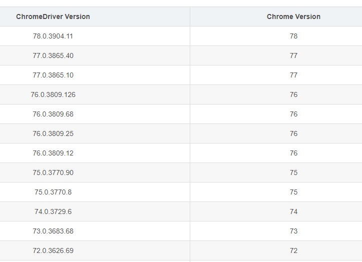

## helloworld程序

```java
public static void main(String[] args) {
    //chromedriver驱动应用程序的地址
    System.setProperty("webdriver.chrome.driver","D:\\myChromeDriver\\chromedriver.exe");
    WebDriver driver = new ChromeDriver();
    driver.get("http://localhost:8080/");
    String title = driver.getTitle();
    System.out.printf(title);
    driver.close();
}
```

# 元素定位

## 元素定位常用操作

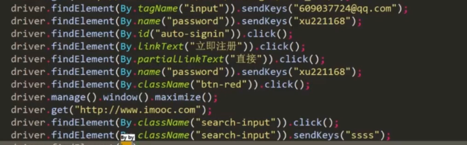

**层级定位**:

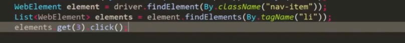

### 常见元素:radio的处理

**选中某个按钮**

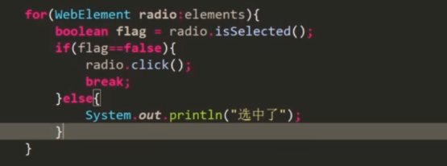

**获取元素的属性**

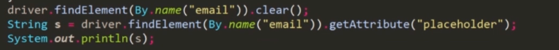

### 常见元素:check的处理

其中clear()无效会报错

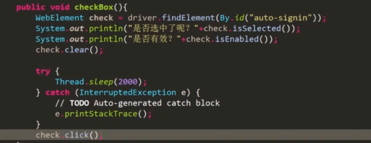

### 常见元素:按钮处理

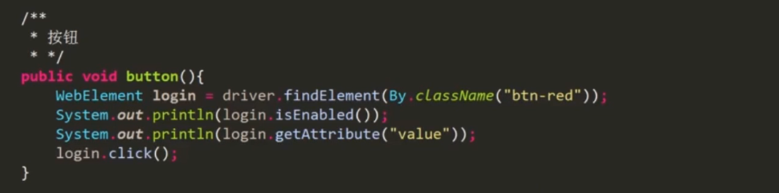

### 常见元素:表单处理

summit()方法提交的方式只是以当前页面的URL后面加上参数进行提交，所以模拟登陆时最好使用click进行操作

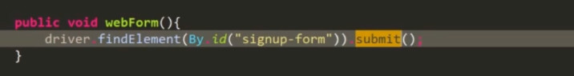

### 常见元素:上传文件处理

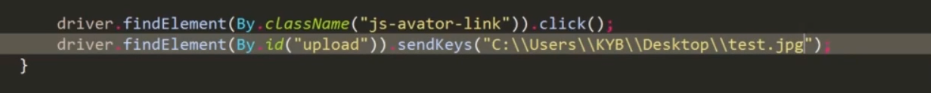

### 常见元素:下拉框处理

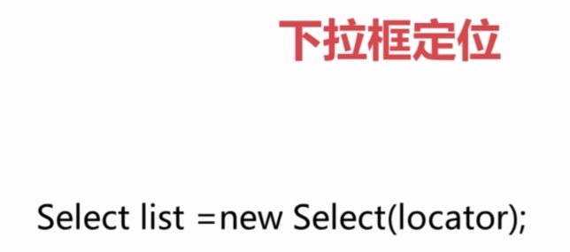

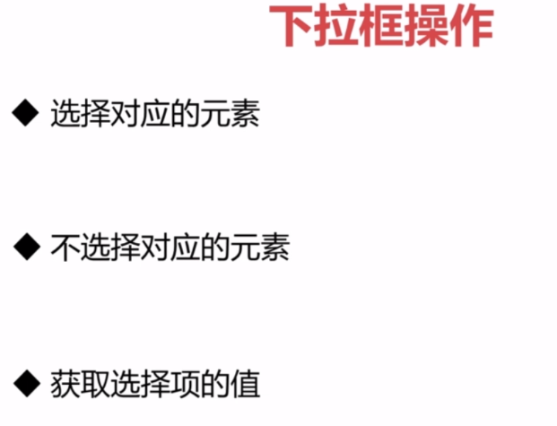

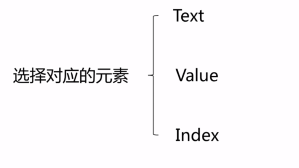

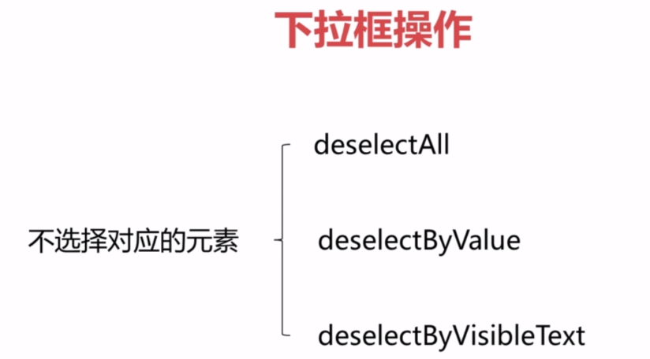

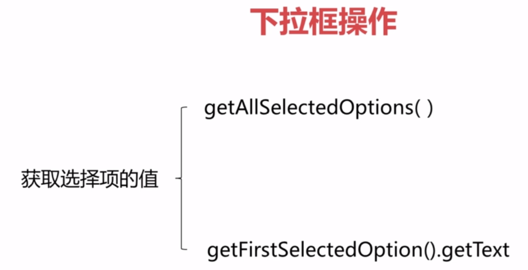


## 使用chrome快速获取XPATH

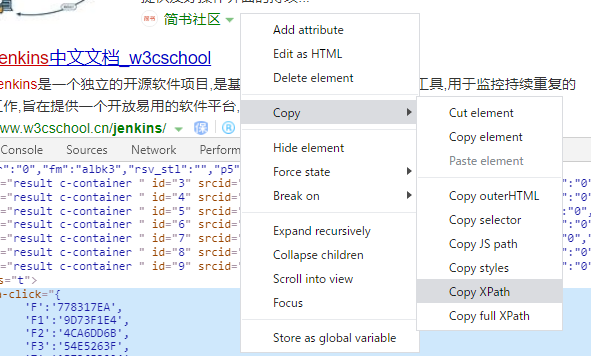

## 使用selenium进行登陆操作

```java
   public static void main(String[] args) {
        //chromedriver服务地址
System.setProperty("webdriver.chrome.driver","D:\\myChromeDriver\\chromedriver.exe");
        WebDriver driver = new ChromeDriver();
        driver.get("http://localhost:8080/");
        driver.manage().window().setSize(new Dimension(480, 800));
        System.out.println(driver.getTitle());
        driver.findElement(By.name("loginID")).sendKeys("xieyun0929");
        driver.findElement(By.name("passwd")).sendKeys("login123");
        driver.findElement(By.className("login")).click();
    }
```


# 详解介绍Selenium常用API的使用--Java语言（完整版）

##  Selenium提供了8种定位方式

假如我们有一个Web页面，通过前端工具（如，Firebug）查看到一个元素的属性是这样的。

```html
<html>
  <head>
  <body link="#0000cc">
    <a id="result_logo" href="/" οnmοusedοwn="return c({'fm':'tab','tab':'logo'})">
    <form id="form" class="fm" name="f" action="/s">
      <span class="soutu-btn"></span>
      <input id="kw" class="s_ipt" name="wd" value="" maxlength="255" autocomplete="off">
```

我们的目的是要定位input标签的输入框。

- 通过id定位：

  ```java
  driver.findElement(By.id("kw"))
  ```

- 通过name定位：

  ```java
  driver.findElement(By.name("wd"))
  ```

- 通过class name定位：

  ```java
  driver.findElement(By.className("s_ipt"))
  ```

- 通过tag name定位：

  ```java
  driver.findElement(By.tagName("input"))
  ```

- 通过`xpath`定位，`xpath`定位有N种写法，这里列几个常用写法：

  ```java
  driver.findElement(By.xpath("//*[@id='kw']"))driver.findElement(By.xpath("//*[@name='wd']"))driver.findElement(By.xpath("//input[@class='s_ipt']"))driver.findElement(By.xpath("/html/body/form/span/input"))driver.findElement(By.xpath("//span[@class='soutu-btn']/input"))driver.findElement(By.xpath("//form[@id='form']/span/input"))driver.findElement(By.xpath("//input[@id='kw' and @name='wd']"))
  ```

- 通过`css`定位，`css`定位有N种写法，这里列几个常用写法：

  ```java
  driver.findElement(By.cssSelector("#kw")driver.findElement(By.cssSelector("[name=wd]")driver.findElement(By.cssSelector(".s_ipt")driver.findElement(By.cssSelector("html > body > form > span > input")driver.findElement(By.cssSelector("span.soutu-btn> input#kw")driver.findElement(By.cssSelector("form#form > span > input")
  ```

接下来，我们的页面上有一组文本链接。

```java
<a class="mnav" href="http://news.baidu.com" name="tj_trnews">新闻</a><a class="mnav" href="http://www.hao123.com" name="tj_trhao123">hao123</a>
```

- 通过link text定位：

  ```java
  driver.findElement(By.linkText("新闻")driver.findElement(By.linkText("hao123")
  ```

- 通过`partialLink` text定位：

  ```java
  driver.findElement(By.partialLinkText("新")driver.findElement(By.partialLinkText("hao")
  ```

## 控制浏览器窗口大小

有时候我们希望能以某种浏览器尺寸找开，访问的页面在这种尺寸下运行。例如可以将浏览器设置成移动端大小(480* 800)，然后访问移动站点，对其样式进行评估；

WebDriver 提供了 `manage().window().setSize()`方法来设置浏览器的大小。

- `maximize() `设置浏览器最大化
- `setSize()` 设置浏览器宽高

用法：

```java
driver.manage().window().maximize();
driver.manage().window().setSize(new Dimension(480, 800));
```

## 控制浏览器后退、前进

在使用浏览器浏览网页时，浏览器提供了后退和前进按钮，可以方便地在浏览过的网页之间切换，WebDriver也提供了对应的back()和forward()方法来模拟后退和前进按钮。下面通过例子来演示这两个方法的使用。

- back() 模拟浏览器后退按钮
- forward() 模拟浏览器前进按钮

```java
    WebDriver driver = new ChromeDriver();
    //get 到百度首页
    driver.get("https://www.baidu.com/");
    //执行浏览器后退
    driver.navigate().back();
    //执行浏览器前面
    driver.navigate().forward();
```

## 刷新页面

```java
//刷新页面
driver.navigate().refresh();
```

## WebDriver 常用方法

下面先来认识 `WebDriver` 中` WebElement `类中最常用的几个方法：

- `clear()` 清除文本。
- `sendKeys(*value) ` 模拟按键输入。
- `click() `单击元素

- `submit()` 用于提交表单。 例如，在搜索框输入关键字之后的“回车” 操作， 就可以通过 submit()方法模拟.

- `getSize() `返回元素的尺寸。
- `getText()` 获取元素的文本。
- `getAttribute(name) `获得属性值。
- `isDisplayed() `设置该元素是否用户可见。

## 模拟鼠标操作

现在的Web产品中提供了更丰富的鼠标交互方式， 例如鼠标右击、双击、悬停、甚至是鼠标拖动等功能。在WebDriver中，将这些关于鼠标操作的方法封装在`ActionChains`类提供。
Actions 类提供了鼠标操作的常用方法：

- `contextClick()` 右击
- `clickAndHold()` 鼠标点击并控制
- `doubleClick()` 双击
- `dragAndDrop() `拖动
- `release() `释放鼠标
- `perform() `执行所有Actions中存储的行为

**使用方法：**

```java
	WebDriver driver = new ChromeDriver();
    driver.get("https://www.baidu.com/");
 
    WebElement search_setting = driver.findElement(By.linkText("设置"));
    Actions action = new Actions(driver);
	//模拟鼠标悬停操作
    action.clickAndHold(search_setting).perform();

    Actions action = new Actions(driver);
    // 鼠标右键点击指定的元素
    action.contextClick(driver.findElement(By.id("element"))).perform();

    // 鼠标右键点击指定的元素
    action.doubleClick(driver.findElement(By.id("element"))).perform();

    // 鼠标拖拽动作， 将 source 元素拖放到 target 元素的位置。
    WebElement source = driver.findElement(By.name("element"));
    WebElement target = driver.findElement(By.name("element"));
    action.dragAndDrop(source,target).perform();

    // 释放鼠标
    action.release().perform();
```

## 模拟键盘操作

```java

public class Keyboard {
  public static void main(String[] args)throws InterruptedException {
    WebDriver driver = new ChromeDriver();
    driver.get("https://www.baidu.com");
    WebElement input = driver.findElement(By.id("kw"));
 
    //输入框输入内容
    input.sendKeys("seleniumm");
    Thread.sleep(2000);
 
    //删除多输入的一个 m
    input.sendKeys(Keys.BACK_SPACE);
    Thread.sleep(2000);
 
    //输入空格键+“教程”
    input.sendKeys(Keys.SPACE);
    input.sendKeys("教程");
    Thread.sleep(2000);
 
    //ctrl+a 全选输入框内容
    input.sendKeys(Keys.CONTROL,"a");
    Thread.sleep(2000);
 
    //ctrl+x 剪切输入框内容
    input.sendKeys(Keys.CONTROL,"x");
    Thread.sleep(2000);
 
    //ctrl+v 粘贴内容到输入框
    input.sendKeys(Keys.CONTROL,"v");
    Thread.sleep(2000);
 
    //通过回车键盘来代替点击操作
    input.sendKeys(Keys.ENTER);
    Thread.sleep(2000);
    driver.quit();
  }
```

 以下为常用的键盘操作：

- `sendKeys(Keys.BACK_SPACE) `回格键（`BackSpace`）
- `sendKeys(Keys.SPACE)` 空格键(Space)
- `sendKeys(Keys.TAB)` 制表键(Tab)
- `sendKeys(Keys.ESCAPE)` 回退键（Esc）
- `sendKeys(Keys.ENTER)` 回车键（Enter）
- `sendKeys(Keys.CONTROL,‘a’)` 全选（Ctrl+A）
- `sendKeys(Keys.CONTROL,‘c’) `复制（Ctrl+C）
- `sendKeys(Keys.CONTROL,‘x’)` 剪切（Ctrl+X）
- `sendKeys(Keys.CONTROL,‘v’)` 粘贴（Ctrl+V）
- `sendKeys(Keys.F1) `键盘 F1
  ……
  `sendKeys(Keys.F12) `键盘 F12 

## 获取断言信息

-  `driver.getTitle()`： 用于获得当前页面的title。
-  `driver.getCurrentUrl()` ： 用户获得当前页面的URL。
-  `webElement.getText() `: 它用于获取标签对之间的文本信息 

## 设置元素等待

 WebDriver提供了两种类型的等待：显式等待和隐式等待。 

## 显示等待(todo:看视频理解)

WebDriver提供了显式等待方法，专门针对某个元素进行等待判断。

```java

  public static void main(String[]args) throws InterruptedException {
 
    WebDriver driver = new ChromeDriver();
    driver.get("https://www.baidu.com");
 
    //显式等待， 针对某个元素等待
    WebDriverWait wait = new WebDriverWait(driver,10,1);
 
    wait.until(new ExpectedCondition<WebElement>(){
      @Override
      public WebElement apply(WebDriver text) {
            return text.findElement(By.id("kw"));
          }
    }).sendKeys("selenium");
 
    driver.findElement(By.id("su")).click();
    Thread.sleep(2000);
 
    driver.quit();
  }
```

`WebDriverWait`类是由`WebDirver`提供的等待方法。在设置时间内，默认每隔一段时间检测一次当前页面元素是否存在，如果超过设置时间检测不到则抛出异常。具体格式如下：
`WebDriverWait(driver, 10, 1)`
driver： 浏览器驱动。 10： 最长超时时间， 默认以秒为单位。 1： 检测的的间隔（步长） 时间， 默认为 0.5s。

## 隐式等待

WebDriver 提供了几种方法来等待元素。

- `implicitlyWait`。识别对象时的超时时间。过了这个时间如果对象还没找到的话就会抛出NoSuchElement异常。
- `setScriptTimeout`。异步脚本的超时时间。WebDriver可以异步执行脚本，这个是设置异步执行脚本脚本返回结果的超时时间。
- `pageLoadTimeout`。页面加载时的超时时间。因为WebDriver会等页面加载完毕再进行后面的操作，所以如果页面超过设置时间依然没有加载完成，那么WebDriver就会抛出异常。

```java
  public static void main(String[] args){
    WebDriver driver = new ChromeDriver();
    //页面加载超时时间设置为 5s
    driver.manage().timeouts().pageLoadTimeout(5, TimeUnit.SECONDS);
    driver.get("https://www.baidu.com/");
      
    //定位对象时给 10s 的时间, 如果 10s 内还定位不到则抛出异常
    driver.manage().timeouts().implicitlyWait(10, TimeUnit.SECONDS);
    driver.findElement(By.id("kw")).sendKeys("selenium");
    
    //异步脚本的超时时间设置成 3s
    driver.manage().timeouts().setScriptTimeout(3, TimeUnit.SECONDS);
    driver.quit();
  }
```

## 定位一组元素

我们已经学习了8种定位方法， 那8种定位方法是针对单个元素定位的， WebDriver还提供了另外8种用于定位一组元素的方法。 

```java
import org.openqa.selenium.By;
......
findElements(By.id())
findElements(By.name())
findElements(By.className())
findElements(By.tagName())
findElements(By.linkText())
findElements(By.partialLinkText())
findElements(By.xpath())
findElements(By.cssSelector())
```

**使用：**

```java
//匹配第一页搜索结果的标题， 循环打印
List<WebElement> search_result = driver.findElements(By.xpath("//div/div/h3"));
//打印元素的个数
System.out.println(search_result.size());
// 循环打印搜索结果的标题
for(WebElement result : search_result){
    System.out.println(result.getText());
}
```

## 多表单切换

 在 Web 应用中经常会遇到 `frame/iframe `表单嵌套页面的应用， WebDriver 只能在一个页面上对元素识别与 定位， 对于` frame/iframe `表单内嵌页面上的元素无法直接定位。 这时就需要通过 `switchTo().frame()`方法将当前定 位的主体切换为 `frame/iframe` 表单的内嵌页面中。 

```java
public static void main(String[] args){
    WebDriver driver = new ChromeDriver();
    driver.get("http://www.126.com");
 
    WebElement xf = driver.findElement(By.xpath("//*[@id='loginDiv']/iframe"));
    driver.switchTo().frame(xf);
    driver.findElement(By.name("email")).clear();
    driver.findElement(By.name("email")).sendKeys("username");
    driver.findElement(By.name("password")).clear();
    driver.findElement(By.name("password")).sendKeys("password");
    driver.findElement(By.id("dologin")).click();
    driver.switchTo().defaultContent();
    //……
  }
```

 如果完成了在当前表单上的操作，则可以通过`switchTo().defaultContent()`方法跳出表单。 

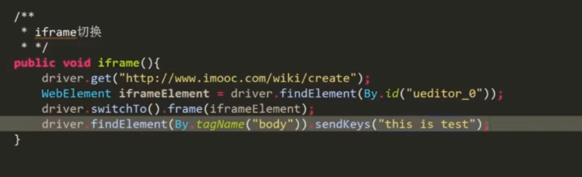

## 多窗口切换（todo:看视频理解）

 在页面操作过程中有时候点击某个链接会弹出新的窗口， 这时就需要主机切换到新打开的窗口上进行操作。WebDriver提供了`driver.switchTo().window(handle);`方法可以实现在不同的窗口之间切换。 

在本例中所涉及的新方法如下：

- `driver.getWindowHandle();`： 获得当前窗口句柄。
- `driver.getWindowHandles()`： 返回的所有窗口的句柄到当前会话。
- `switchTo().window()`： 用于切换到相应的窗口，与上一节的switchTo().frame()类似，前者用于不同窗口的切换， 后者用于不同表单之间的切换。

```java
public static void main(String[] arge) throws InterruptedException{
 
    WebDriver driver = new ChromeDriver();
    driver.get("https://www.baidu.com");
 
    //获得当前窗口句柄
    String search_handle = driver.getWindowHandle();
 
    //打开百度注册窗口
    driver.findElement(By.linkText("登录")).click();
    Thread.sleep(3000);
    driver.findElement(By.linkText("立即注册")).click();
 
    //获得所有窗口句柄
    Set<String> handles = driver.getWindowHandles();
 
    //判断是否为注册窗口， 并操作注册窗口上的元素
    for(String handle : handles){
      if (handle.equals(search_handle)==false){
          
        //切换到注册页面
        driver.switchTo().window(handle);
          
        System.out.println("now register window!");
        Thread.sleep(2000);
        driver.findElement(By.name("userName")).clear();
        driver.findElement(By.name("userName")).sendKeys("user name");
        driver.findElement(By.name("phone")).clear();
        driver.findElement(By.name("phone")).sendKeys("phone number");
        //......
        Thread.sleep(2000);
        //关闭当前窗口
        driver.close();
      }
    }
    Thread.sleep(2000);
 
    driver.quit();
  }
}
```

## 下拉框选择

```html
<select id="nr" name="NR">
  <option value="10" selected>每页显示 10 条</option>
  <option value="20">每页显示 20 条</option>
  <option value="50">每页显示 50 条</option>
<select>
```

```java
    //<select>标签的下拉框选择,选择第2条
    WebElement el = driver.findElement(By.xpath("//select"));
    Select sel = new Select(el);
    sel.selectByValue("20");
    Thread.sleep(2000);
```


## 警告框处理

在 WebDriver中处理JavaScript所生成的alert、confirm以及prompt十分简单，具体做法是使用switch_to_alert()方法定位到alert/confirm/prompt，然后使用text/accept/dismiss/sendKeys等方法进行操作。

- `getText()`： 返回 alert/confirm/prompt 中的文字信息。
- `accept()`： 接受现有警告框。
- `dismiss()`： 解散现有警告框。
- `sendKeys(keysToSend)`： 发送文本至警告框。
- `keysToSend`： 将文本发送至警告框。

如下图，百度搜索设置弹出的窗口是不能通过前端工具对其进行定位的，这个时候就可以通过switchTo().alert()方法接受这个弹窗。

## 文件上传

 对于通过input标签实现的上传功能，可以将其看作是一个输入框，即通过`sendKeys()`**指定本地文件路径**的方式实现文件上传。 

 创建upfile.html文件，代码如下： 

```html
<html>
<head>
<meta http-equiv="content-type" content="text/html;charset=utf-8" />
<title>upload_file</title>
<link href="http://cdn.bootcss.com/bootstrap/3.3.0/css/bootstrap.min.css" rel="stylesheet" />
</head>
<body>
  <div class="row-fluid">
	<div class="span6 well">
	<h3>upload_file</h3>
	  <input type="file" name="file" />
	</div>
  </div>
</body>
<script src="http://cdn.bootcss.com/bootstrap/3.3.0/css/bootstrap.min.js"></scrip>
</html>
```

```java
//定位上传按钮， 添加本地文件
driver.findElement(By.name("file")).sendKeys("D:\\upload_file.txt");
Thread.sleep(5000);
```

## 浏览器cookie操作

WebDriver 操作Cookie的方法：

- `getCookies() `获得所有 cookie 信息。
- `getCookieNamed(String name) `返回字典的key为“name”的Cookie信息。
- `addCookie(cookie dict) `添加Cookie。`“cookie_dict”`指字典对象，必须有 name和value值。
- `deleteCookieNamed(String name) `删除Cookie 信息。 “name”是要删除的 cookie的名称； 
- `optionsString` 是该Cookie的选项，目前支持的选项包括“路径” ， “域” 。
- `deleteAllCookies()` 删除所有 cookie 信息。

```java
WebDriver driver = new ChromeDriver();
driver.get("https://www.baidu.com");

Cookie c1 = new Cookie("name", "key-aaaaaaa");
Cookie c2 = new Cookie("value", "value-bbbbbb");
driver.manage().addCookie(c1);
driver.manage().addCookie(c2);

//获得 cookie
Set<Cookie> coo = driver.manage().getCookies();
System.out.println(coo);

//删除所有 cookie
//driver.manage().deleteAllCookies();
```

**`js`实现页面打开自动定位到指定元素位置**

```js
 document.getElementById("moreMerchant").scrollIntoView() 
```

##  获取窗口截图 

自动化用例是由程序去执行，因此有时候打印的错误信息并不十分明确。如果在脚本执行出错的时候能对当前窗口截图保存，那么通过图片就可以非常直观地看出出错的原因。 WebDriver提供了截图函数`getScreenshotAs()`来截取当前窗口。

```java
  public static void main(String[] arge){
 
    WebDriver driver = new ChromeDriver();
    driver.get("https://www.baidu.com");
 
    File srcFile = ((TakesScreenshot)driver).getScreenshotAs(OutputType.FILE);
    try {
      FileUtils.copyFile(srcFile,new File("d:\\screenshot.png"));
    } catch (IOException e) {
      e.printStackTrace();
    }
    driver.quit();
  }

```