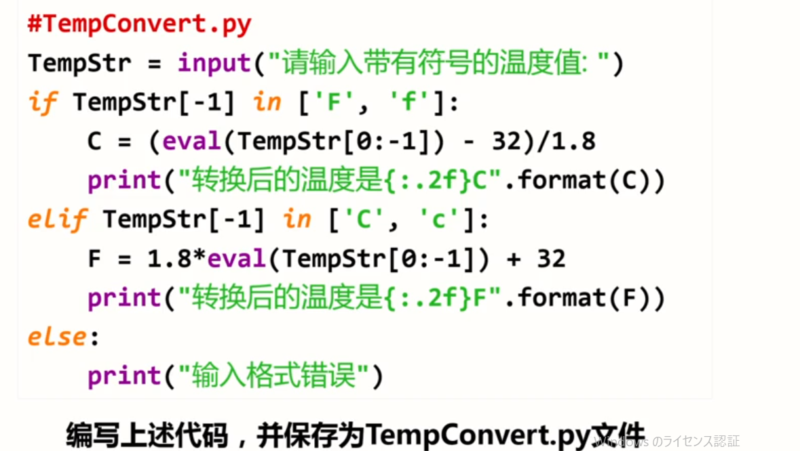

# Python基础语法

### 实例1：圆的面积

交互式：

```python
>>> r= 25
>>> area = 3.1415 * r * r
>>> print(area)
1963.4375000000002
>>> print("{:.2f}".format(area))
1963.44
```

文件式：

```python
r= 25
area = 3.1415 * r * r
print(area)
print("{:.2f}".format(area))
```

### 实例2：温度转换



### 注释


