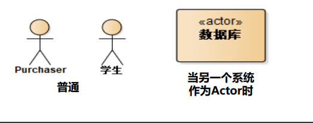
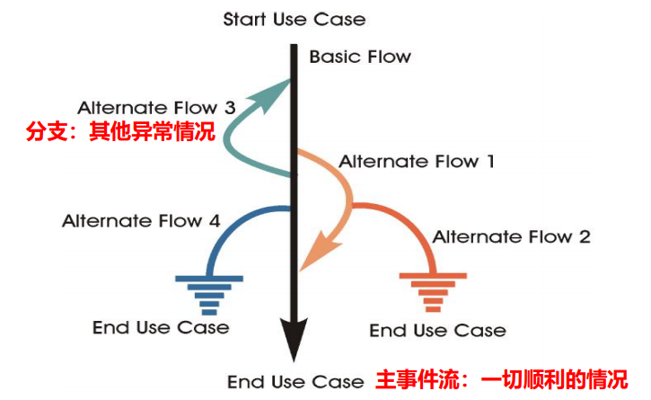
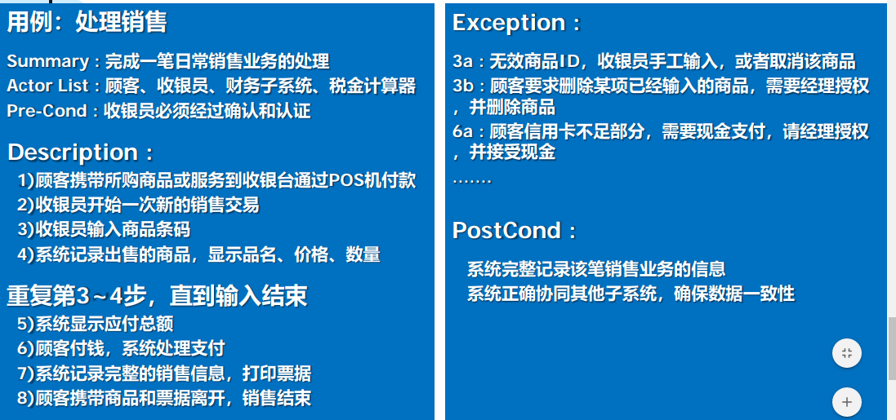
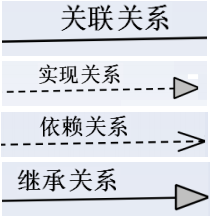
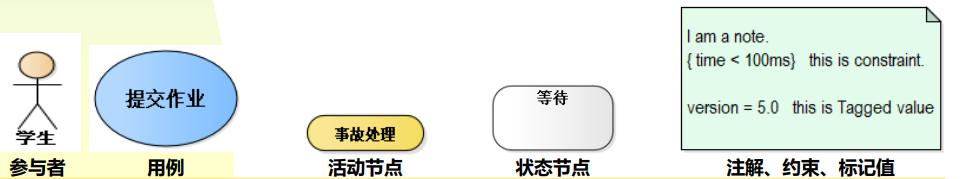
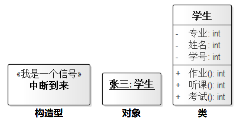

## 艾伦.凯(Alan Kay)的成就 	

- Smalltalk语言之父
- 创造性地提出面向对象编程思想
- 提出`Dynabook`的概念
- 2003年获得图灵奖

### 面向对象3大特征

- 封装 Encapsulation
- 继承 Inheritance
- 多态 Polymorphism

### “面向对象”的思考方式的核心特征

- 聚合/组合  Aggregation/Composition
- 接口/实现  Interface/Implementation
- 抽象  Abstraction 

###  “is a” relationship and  “has a” relationship

- **Inheritance** means that one class inherits the characteristics of another class.
- **Aggregation** describes a “has a” relationship. One object is a part of another object.
- **composition**: A variant of aggregation is composition which adds the property of existence dependency. (聚合关系的一个变种，称为组合。整体控制着部分的生命)

> 有些时候，**Aggregation** 与**composition**的关系不是很明确

### 面向过程与面向对象的比较

- 程序结构的比较：
  - 面向过程侧重于考虑方法的编写（哪个方法做什么事 ，不考虑所涉及的数据在哪里）
  - 面向对象则致力于将数据和方法先做一个封装（分配 一个对象做事，先考所需要的数据是否和它在一起）
- 通信比较：
  - 过程化解决方法通过信道传递数据，服务器端需要有 专门的工具对接受的数据进行处理
  - 面向对象解决方法通过信道传递对象（数据+对数据的处理方法）

### 简单描述”多态（Polymorphism）“

- 本意：有多种形态 “Having many forms”
- 同一类族，不同对象，接收相同消息，不同处理。
- 多态的核心思想：使用指向父类的指针或者引用，能够调用子类的对象。

## UML

### 参与者（Actor)

- 代表位于{{c1:: 系统之外并和系统进行交互的一类事物（人、物、其他软件子系统等）}}
- 通过它，可以对软件系统与外界发生的交互进行分析和描述
- 通过它，可以了解客户希望软件系统提供哪些功能

### 根据下面的问题来寻找系统的参与者

1. 谁使用系统？
2. 谁安装系统、维护系统？
3. 谁启动系统、关闭系统？
4. 谁从系统中获取信息，谁提供信息给系统？
5. 在系统交互中，谁扮演了什么角色？
6. 系统会与哪些其他系统相关联？
7. 内/外部定时器

> 对每一类参与者要有简短描述,如， 学生：需要参加培养计划规定的课程，并通过考核

### 用例(Usecase)

- 系统为**响应参与者**引发的一个事件而执行的**一系列的处理/动作**，而这些 处理应该为参与者**产生一种有价值的结果**
- 这些动作
  - 不但应包含**正常情况**的各种动作序列
  - 而且应包含对**非正常情况**时软件系统的动作序列的描述，Exception / Alternate

> 每个用例都有一个名称：短小精悍的“动名词”

### 可以根据下面的一些问题来识别用例

1. 参与者希望系统提供什么功能
2. 系统是否存储和检索信息
3. 当系统改变状态时，是否通知参与者 
4. 是否存在影响系统的外部事件，是哪个参与者通知系统这些外部事件
5. 哪个参与者触发了活动？

### 用例图中的关系

- 参与者与用例之间
  - **关联关系**: 用实线表示 
- 参与者/参与者之间的关系
  - **泛化关系**：实线+空心箭头
- 用例之间的关系
  - **泛化关系** 例如、发出订单 - 网上发出订单
  - **含关系**《include》
  - **扩展关系**《extend》

### 用例描述

主事件流：一切正 常时的动作序列

异常事件或者可选事件流：主事件流 的每一步都有可能 出现异常，此处描述异常情况的处理

### 案例：POS系统的用例

### UML的4种关系

### UML的常用元素

{{c1:: }}

{{c1:: }}

